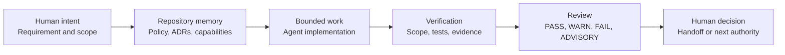

# Agent Governance Starter Kit

[](https://github.com/Andy-JunXiong/agent-governance-starter/actions/workflows/ci.yml)
[](https://andy-junxiong.github.io/agent-governance-starter/)

**Make AI-assisted repositories reviewable by default.**

AgentGov keeps humans in control of AI-written code. It records the work a
coding agent was allowed to do, checks deterministic repository facts, keeps
semantic uncertainty visible as `ADVISORY`, and separates verified completion
from permission to commit, merge, publish, release, or deploy.

[](https://andy-junxiong.github.io/agent-governance-starter/)

<p align="center">
  <strong>Follow one coding-agent task from intent to bounded handoff.</strong>
  <br><br>
  <a href="https://andy-junxiong.github.io/agent-governance-starter/"><strong>Open the interactive product demo &rarr;</strong></a>
  &nbsp;&middot;&nbsp;
  <a href="https://andy-junxiong.github.io/agent-governance-starter/governed-refund-walkthrough.html">Follow the 60-to-90-second walkthrough</a>
  &nbsp;&middot;&nbsp;
  <a href="https://andy-junxiong.github.io/agent-governance-starter/portfolio.html">Inspect the evidence portfolio</a>
  &nbsp;&middot;&nbsp;
  <a href="https://andy-junxiong.github.io/agent-governance-starter/quickstart.html">Read the quickstart</a>
</p>

> **Project status:** stable `0.2.1` provides installable repository governance.
> Published prerelease `0.3.0rc1` and current development source extend the
> development-time journey; this showcase does not prove universal host or
> consumer adoption. No check or demo authorizes commit, merge, publication,
> release, or deployment.

## Product overview

Coding agents can produce locally correct changes while the real requirement,
architecture constraints, allowed file scope, evidence, and consequential
authority remain implicit. AgentGov makes those boundaries inspectable inside
the repository and checks them before a pull request becomes the first place
drift is discovered.

It is designed for maintainers and teams using coding agents in software,
agentic-runtime, ML, decision-support, or research-evaluation repositories.
The starter is lightweight, dependency-free at runtime, and portable across
projects. Pull requests and CI remain an independent backstop.

AgentGov has three distinct release states:

| Channel | What it provides | Boundary |
|---|---|---|
| **Stable `0.2.1`** | Installable repository governance: safe inspection and adoption, deterministic checks, findings, reports, status, consumer CI, and reviewed update flows. | This is the supported first-use path. Checks do not approve semantic quality or consequential actions. |
| **Published prerelease `0.3.0rc1`** | A review candidate for development-time governance: admitted tasks, context, Git scope, fresh completion evidence, guided routing, redacted events, a static Development Monitor, and verified handoff. | It is not stable and has not been adopted by a consumer repository. |
| **Current development source** | Later work on automatic coding-agent journeys, native human decision surfaces, Codex adapters, replay safety, and completion recording. It also extends `doctor` with a bounded Git-worktree access preflight for required project MCP startup. | Development-source behavior may be newer than the published prerelease. It is not automatically published, released, installed, or active in consumers. |

See [release channels](docs/release-channels.md), the
[`0.3.0rc1` release notes](docs/releases/0.3.0rc1.md), and
[current repository status](STATUS.md) for exact evidence and limitations.

## Why AgentGov

Without explicit repository contracts, reviewers struggle to answer basic
questions:

- What outcome and smallest change did the human actually admit?
- Which architecture decisions constrain the coding agent?
- Did the working copy drift beyond the admitted file scope?
- Which capability, implementation, contract, and evaluation evidence belong
  together?
- Which findings are deterministic, and which require accountable judgment?
- Has evidence become stale since it was reviewed?
- Who may decide to merge, publish, release, or deploy?

AgentGov connects those facts without pretending that a static checker can
replace product, architecture, security, or release judgment.

## Architecture



The minimum sufficient Kernel keeps portable governance meaning separate from
Policy, Application/Product Surface, Adapter, Consumer Context, and Experiment
responsibilities. `Completion Verified` and `Bounded Handoff` are distinct
transitions: fresh evidence can show that admitted work is complete without
granting the next authority.

Durable architecture lives in the [governance model](docs/governance-model.md),
[ADR-0013](docs/adr/0013-make-automatic-governance-and-dashboard-primary.md),
[ADR-0016](docs/adr/0016-establish-minimum-sufficient-kernel-architecture.md),
and the [invariant register](docs/adr/INVARIANTS.md). This README intentionally
keeps only the overview diagram.

## What it governs

| Concern | Repository evidence | AgentGov boundary |
|---|---|---|
| Requirement and scope | Human-admitted task records and changed-file reports | Structure and path decisions can be checked; requirement quality remains human judgment. |
| Architecture | `AGENTS.md`, ADRs, invariants, and selected context | Drift can be surfaced; architecture is not approved by keyword matching. |
| AI capabilities | Inventory, manifests, callers, contracts, owners, risk, and provenance | References and contracts are deterministic; capability sufficiency is advisory. |
| Evaluation readiness | Cases, evidence, review metadata, and explicit readiness | Incomplete evidence remains visible instead of becoming a misleading pass. |
| Evidence validity | Explicit review dates, expiry, policy status, and invalidating events | Review cadence can warn; only declared expiry or invalidation facts fail. |
| Review artifacts | Canonical manifest snapshots and source hashes | Matching hashes detect change, not correctness or safety. |
| Consequential actions | Explicit human authority boundaries | No check authorizes commit, merge, publication, release, or deployment. |

The project reports four finding states:

- `PASS`: a deterministic contract is satisfied.
- `WARN`: a valid, non-blocking configuration or evidence state is incomplete.
- `FAIL`: a deterministic requirement is broken or evidence is stale.
- `ADVISORY`: accountable human judgment is still required.

These states describe repository evidence. AgentGov does not calculate a
governance coverage percentage, infer prevented incidents or ROI, or turn an
advisory opinion into an objective failure.

## Quickstart

The supported first-use path installs stable `0.2.1` into an isolated pipx
environment. It does not copy this source repository into the project you want
to govern.

```powershell
python --version
pipx install "https://github.com/Andy-JunXiong/agent-governance-starter/releases/download/v0.2.1/agent_governance_starter-0.2.1-py3-none-any.whl"
agentgov --version
agentgov --help
```

For a new or empty project, create the starter files and run the repository
contract:

```powershell
$Project = Join-Path $PWD "governed-example"
agentgov init $Project --project-name "Example Project"
agentgov check repository $Project
agentgov report repository $Project --output "$Project/governance-report.md"
```

Initialization is create-missing-only and reports unresolved placeholders for
human review. A successful command means the checks ran; it does not mean the
new project is semantically complete or approved.

For an existing repository, inspect before writing and preview the exact
adoption plan:

```powershell
agentgov inspect path/to/repository
agentgov adopt path/to/repository --project-name "Example Project" --dry-run
```

Existing files are preserved. Review the plan before running adoption without
`--dry-run`. The command does not stage, commit, merge, publish, release, or
deploy anything.

The browser-friendly [English Quickstart](docs/quickstart.html),
[Chinese Quickstart](docs/quickstart.zh-CN.html), and
[Chinese Markdown Quickstart](docs/quickstart.zh-CN.md) provide the complete
copyable paths. Existing repositories should continue with
[existing-repository adoption](docs/existing-repository-adoption.md) and the
[generated-files guide](docs/generated-files-guide.md). Common installation,
finding, report, and exit-code issues are covered by
[troubleshooting](docs/troubleshooting.md).

### Stable orientation and updates

Running `agentgov` without arguments is a read-only orientation surface. After
installation, these commands show environment and repository health, the next
bounded action, current governance usage, and update availability:

```powershell
agentgov doctor .
agentgov next .
agentgov status .
agentgov update --check .
```

Installation necessarily happens before `agentgov next` can inspect the
repository. `agentgov update --check` is read-only; applying an update is a
separate preview and exact-confirmation flow. Current development source adds
the `repository:git-access` doctor finding for the same account that will
launch a required project MCP server. That finding does not echo raw Git
output, modify `safe.directory`, or weaken required-server startup behavior.

## Governed example

The [60-to-90-second governed refund walkthrough](docs/governed-refund-walkthrough.html)
shows a development-source journey in which a broad task is narrowed by a
human, a changed-file scope failure blocks completion, and fresh evidence
supports a bounded handoff. It is a product demonstration, not proof that an
automatic primary experience works in every host or project.

For a repository-level example you can run locally:

```powershell
$Project = Join-Path $PWD "governed-demo"
agentgov init $Project --project-name "Portfolio Demo"
agentgov check repository $Project
agentgov report repository $Project --output "$Project/governance-report.md"
```

The generated example intentionally retains honest `WARN` and `ADVISORY`
findings. Open the [illustrative sample governance report](docs/demo-governance-report.html)
to see how deterministic results, known gaps, recommended actions, and human
review boundaries appear together.

## Product direction

Stable AgentGov is a repository-governance CLI. The accepted development
direction is an automatic coding-agent loop with a protection and benefit
Dashboard:

```text
Human requests work through a coding agent
  -> AgentGov admits or routes the exact task and relevant context
  -> bounded implementation is observed against scope and evidence
  -> completion is reconciled and the Dashboard is refreshed
  -> a human decides at semantic and authority boundaries
  -> PR and CI independently replay deterministic facts
```

The low-level `agentgov dev`, `govern start`, `govern check`, `govern finish`,
Monitor, and handoff commands remain development, headless, CI, diagnostic,
testing, fallback, and recovery primitives. They are not the intended ordinary
user journey. Agent protocols such as `requirement-admission`,
`action-loop-stagnation`, and `reconcile-invariants` advise the coding agent;
an advisory request is not a mechanical runtime halt.

Current source includes Codex lifecycle hooks, a foreground Governance MCP
Adapter, native human-owned task admission where the host supports it, and
active-Agent self-review after resolved alignment. These are development
surfaces, not proof that a production model will always select the right tool.
They do not provide cryptographic personal identity, an independent high-risk
Reviewer, or autonomous authority. See the [automatic-governance product
requirements](docs/product-requirements-automatic-governance.md),
[Codex hooks Adapter](docs/codex-hooks-adapter.md),
[Governance MCP Adapter](docs/governance-mcp-adapter.md), and
[active-Agent self-review](docs/active-agent-self-review.md).

## Product boundaries

AgentGov is not:

- a compliance certification or runtime security boundary;
- a general configuration-quality linter;
- a general-purpose LLM evaluation platform;
- a SaaS control plane, deployment system, or autonomous merge service;
- proof that declared governance is complete, effective, or correctly owned;
- authority to change another repository, consumer, release, or environment.

The package validates deterministic facts and keeps uncertainty reviewable.
Humans still own product meaning, architecture tradeoffs, exceptions, risk
acceptance, and consequential transitions.

## Documentation map

The README is the product entry. Detailed material remains with its existing
owner rather than being duplicated here.

### Use the product

- [Product homepage](docs/index.html): the plain-language public product story.
- [Public product site](https://andy-junxiong.github.io/agent-governance-starter/)
  and [public evidence portfolio](https://andy-junxiong.github.io/agent-governance-starter/portfolio.html):
  rendered entry and evidence surfaces.
- [English Quickstart](docs/quickstart.html): stable installation and first use.
- [Existing-repository adoption](docs/existing-repository-adoption.md): inspect,
  preview, create-missing-only adoption, and validation.
- [Generated-files guide](docs/generated-files-guide.md): decisions required in
  the generated scaffold.
- [Troubleshooting](docs/troubleshooting.md): installation, conflicts, findings,
  reports, artifacts, and exit codes.
- [Consumer CI](docs/consumer-ci.md): pinned checks, report artifacts, status,
  upgrades, and remaining human authority.
- [Templates](templates/README.md): the portable starter files.

### Govern development

- [Development task contract](docs/development-task-contract.md): exact task
  scope, decision, risk, and validation declarations.
- [Changed-file scope](docs/development-scope-check.md): Git inventory and path
  policy.
- [Fresh completion evidence](docs/development-evidence.md): validation,
  snapshots, and reconciliation.
- [Guided development session](docs/development-session.md): start, check,
  finish, and handoff primitives.
- [Task proposal and admission](docs/task-proposal-admission.md): normalized
  proposals and exact human admission.
- [Admission routing](docs/admission-routing.md): no-task, active-task,
  fast-track, and human-review boundaries.
- [Human decision prompts](docs/human-decision-prompts.md): digest-bound
  selection and host capability limits.
- [Clarification dialogue](docs/clarification-dialogue.md): discussion before a
  durable alignment decision.
- [Development Monitor](docs/development-monitor.md): local protection state and
  observed, inferred, and unknown layers.
- [Drift-review reminders](docs/drift-review-reminders.md): advisory foreground
  and scheduled review cadence.
- [Clean-target replay preflight](docs/clean-target-replay-preflight.md) and the
  [harness contract](docs/harness-contract-v1.md): privacy-bounded replay gates
  and evidence normalization.

### Understand the architecture

- [Governance model](docs/governance-model.md): end-to-end product and finding
  semantics.
- [Architecture decisions](docs/adr/): durable choices and boundaries.
- [Capability control mapping](docs/control-mapping.md) and
  [capability dependencies](docs/capability-dependencies.md): deterministic
  relationships and advisory limits.
- [Evaluation readiness](evaluation/README.md) and its
  [readiness policy](evaluation/readiness-policy.md): evidence maturity without
  unsupported quality claims.
- [Agent operating protocols](agent-skills/README.md): portable triggers,
  checks, escalation, and handoff guidance.

### Review evidence

- [Current status](STATUS.md): current release and capability reality,
  validation, incomplete work, blockers, and the next product review.
- [Development log index](docs/development-log/INDEX.md): dated append-only
  session evidence.
- [Evidence portfolio](docs/portfolio.html): claims connected to their limits
  and repository sources.
- [Interview guide](docs/interview-guide.md): reviewer-oriented presentation
  order, commands, evidence, and honest limitations.
- [Human adoption pilot](docs/human-adoption-pilot.md), its
  [record template](docs/human-adoption-record.template.md), and the
  [uncoached participant handout](docs/uncoached-onboarding-handout.md): genuine
  reader and first-use evidence without substituting automated timing.
- [Documentation archive plan](docs/documentation-archive-plan.md): the bounded
  logical index and explicit non-destructive authority model.
- [Release review](docs/release-review.md) and
  [consumer upgrade review](docs/consumer-upgrade-review.md): evidence bundles
  that remain separate from human decisions.
- [Evidence Freshness v1](docs/specs/evidence-freshness-v1.md): explicit review,
  expiry, policy-validity, invalidation, and not-applicable semantics without
  inferring expiry from elapsed time.

## Development

Python 3.11 or newer is required. From a source checkout, run the baseline:

```powershell
$env:PYTHONPATH = "src"
python -m unittest discover -s tests -v
```

Common source commands:

```powershell
$env:PYTHONPATH = "src"
python -m agentgov --help
python -m agentgov check repository .
python -m agentgov report repository . --format json
```

Repository changes are governed by `AGENTS.md` and exact human-admitted records
under `governance/tasks/`. A task record authorizes only its declared scope. It
does not authorize Git operations, publication, release, deployment, or a
follow-on task.

The most useful contributor paths are:

| Path | Purpose |
|---|---|
| `src/agentgov/` | Dependency-free CLI and governance contracts. |
| `governance/` | This repository's own inventory, capabilities, tasks, and evidence. |
| `schemas/` | Versioned machine-readable contracts. |
| `templates/` | Portable starter-kit files. |
| `agent-skills/` | Reusable coding-agent operating protocols. |
| `evaluation/` | Readiness policy, schemas, and fixtures. |
| `docs/` | Product guides, architecture, evidence, and release records. |
| `tests/` | Contract, behavior, documentation, and fixture coverage. |

## Source boundary

The initial patterns were extracted from lessons learned while building AI
Radar. AI Radar remains a separate product and repository. This project does
not import its runtime packages, data, credentials, infrastructure, business
thresholds, or deployment workflows. Reuse decisions are recorded in the
[AI Radar extraction map](docs/ai-radar-extraction-map.md).

## License

Released under the [MIT License](LICENSE).
