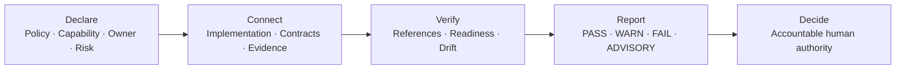
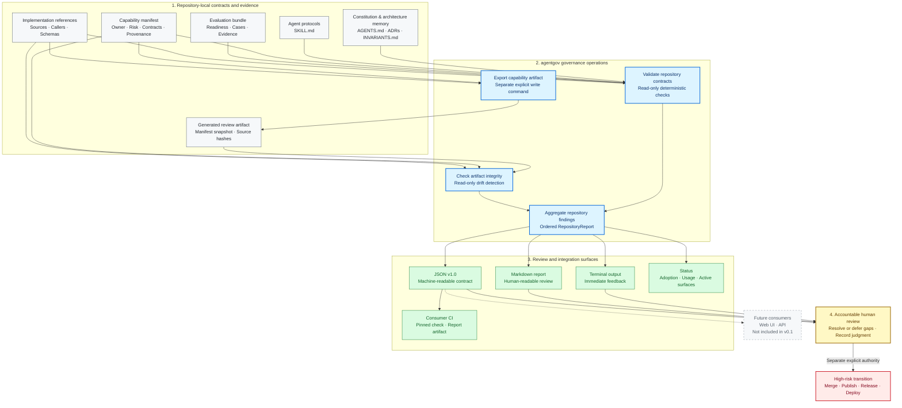

# Agent Governance Starter Kit

**Make AI-assisted repositories reviewable by default.**

A lightweight, repository-native governance framework that connects AI
capabilities, implementation evidence, deterministic checks, and accountable
human decisions.

[](https://github.com/Andy-JunXiong/agent-governance-starter/actions/workflows/ci.yml)

[Explore the product](docs/index.html) ·
[Open the sample governance report](docs/demo-governance-report.html) ·
[Run the quickstart](#runnable-cli-example) ·
[Inspect the architecture](#detailed-architecture)

## Why this exists

AI-assisted repositories accumulate agent instructions, capability
declarations, implementation references, evaluation evidence, and approval
rules. Those files can all exist while reviewers still cannot answer:

- What AI capability is actually present?
- Who owns it, and what decisions may it influence?
- Which implementation and evidence support its claims?
- Did reviewed sources change afterward?
- Which findings are deterministic, and which still require human judgment?

Agent Governance Starter Kit turns those disconnected claims into explicit
repository contracts. It checks what can be checked deterministically and
keeps semantic judgment, merge, publication, release, and deployment under
separate human authority.

## Architecture at a glance



The CLI verifies declared repository facts. It does not run the AI capability,
judge output quality, calculate a governance score, or approve high-risk work.


_Actual output from a sanitized synthetic repository: its capability contract
is valid, evaluation evidence remains incomplete, and a later source change
invalidates the generated review artifact._

## What makes it different

| Without explicit contracts | With Agent Governance Starter Kit |
|---|---|
| Prompt, source, test, and review relationships remain implicit. | A manifest connects sources, callers, contracts, evidence, and review metadata. |
| A source change after review is easy to miss. | Artifact hashes report deterministic source drift. |
| Missing evaluation cases can be mistaken for readiness. | `needs_seed_cases` remains an explicit `WARN`. |
| A successful command can be mistaken for approval. | Human approval remains an external boundary. |

## What this project demonstrates

- strict capability manifests with ownership, risk, contracts, provenance, and
  human-review metadata;
- explicit repository inventory closure connecting canonical manifests,
  accountable owners, governance status, and reasoned exclusions;
- strict capability control mappings with explicit applicability, enforcement
  mode, ownership, exception authority, and readable evidence references;
- explicit capability dependency declarations with Inventory closure, cycle
  detection, and optional minimum-readiness floors;
- validation of repository-local schemas, callers, sources, and evaluation
  evidence references;
- explicit evaluation-readiness states that distinguish incomplete evidence
  from supported baseline or regression claims;
- reusable agent operating protocols with triggers, stop conditions, checks,
  escalation, and handoff contracts;
- deterministic, reviewable capability artifacts;
- source, manifest, and generated-artifact drift detection;
- repository-level `PASS`, `WARN`, `FAIL`, and `ADVISORY` findings;
- deterministic Markdown and versioned JSON governance reports;
- an installable Python CLI with stable exit-code semantics;
- automated tests and cross-platform CI on Windows and Ubuntu for Python
  3.11, 3.12, and 3.13.

## Scope boundaries

- This is not a general configuration-quality linter, and it does not score
  AGENTS.md or CLAUDE.md writing quality.
- It does not provide runtime policy enforcement or act as a security boundary.
- It connects capability declarations, repository sources, validation
  readiness, generated review artifacts, and human-review requirements.
- Deterministic failures may block automation through a non-zero exit code;
  semantic quality and governance sufficiency remain human-review concerns.
- A matching source hash proves that declared content has not changed since
  artifact generation; it does not prove that the content is correct.
- Missing evidence remains an incomplete readiness state instead of becoming a
  misleading pass or unsupported governance percentage.

## Runnable CLI example

Install the current package into an isolated pipx environment.
This does not copy the starter source tree into the repository you want to
govern:

```powershell
python --version
pipx install "https://github.com/Andy-JunXiong/agent-governance-starter/releases/download/v0.1.0/agent_governance_starter-0.1.0-py3-none-any.whl"
agentgov --version
agentgov --help
```

For an existing installation, use one command to check the tool and repository,
preview the exact bounded change, request one `UPDATE` confirmation, apply it,
and rerun validation:

```powershell
agentgov update .
```

Use `--check` for a strictly read-only CI or diagnostic result:

```powershell
agentgov update --check .
```

See whether governance is merely present or is connected to project workflows:

```powershell
agentgov status .
agentgov status . --format markdown
```

The status surface lists the repository contract, GitHub Actions integration,
declared capabilities, their callers and evaluation readiness, active review
surfaces, and the next accountable action. Markdown output is designed for a
GitHub Actions job summary and uses portable repository-relative commands. It
is read-only and does not run the project or production workflows.

These `status` and `integrate` commands are available in stable `0.2.0`. The
prepared `0.2.1` patch corrects the managed workflow's local wheel filename;
the checks, reports, and human-confirmed update boundary are unchanged.

Preview a pinned consumer CI workflow, then explicitly create it after review:

```powershell
agentgov integrate github-actions . --dry-run
agentgov integrate github-actions .
```

The generated workflow verifies and installs a fixed AgentGov Release, records update state,
writes the JSON repository report on every push or pull request, and uploads the
reports as CI artifacts. Starting with 0.2, it also generates the consumer-local
stable upgrade review, appends it to the job summary, and uploads its evidence.
It also checks for stable updates on a weekday schedule when the repository has
no push or pull-request activity.
It uses read-only repository permissions, does not install adopting-project
dependencies, and never authorizes merge, release, deployment, or production
execution. Existing workflow content is never overwritten.

Prepare—but do not execute—the exact change for a future upgrade PR:

```powershell
agentgov plan upgrade-pr . --manifest release-manifest.json
```

Create the consumer-facing upgrade review inside the adopting project:

```powershell
agentgov review upgrade . --manifest release-manifest.json `
  --output agentgov-upgrade-review
```

Compare two preserved CI reports as honest benefit evidence:

```powershell
agentgov benefits compare before.json after.json
```

Collect one candidate wheel, manifest, source-test, and NYC compatibility review
without making the release decision:

```powershell
agentgov review release . --wheel <WHEEL> --manifest <MANIFEST> `
  --consumer <CONSUMER_REPOSITORY> --output <NEW_REVIEW_DIRECTORY>
```

Upgrade planning and benefit comparison are read-only. Release and consumer
upgrade review write only their explicitly named new evidence directories and
refuse existing output. Consumer upgrade review does not apply the planned
workflow change. None of these commands creates a branch, pull request, tag,
release, deployment, causal claim, coverage percentage, or ROI claim.

The updater discovers the latest stable GitHub Release manifest, downloads the
fixed-tag wheel into a temporary directory, verifies its SHA-256, upgrades the
pipx environment, verifies the installed version, and relaunches the new
`agentgov` process before repository refresh. Mutable branch files are never
used as installation metadata. Redirected input, JSON mode, and non-interactive
mode never authorize writes. `agentgov refresh` remains available as an
advanced repository-only preview/apply command.

Interactive update output uses explicit terminal states:

- `SUCCESS`: update and final validation completed;
- `CANCELLED`: confirmation was not granted and nothing changed;
- `BLOCKED`: compatibility, integrity, or release metadata prevents a write;
- `INTERRUPTED`: execution stopped before a write;
- `PARTIAL`: a declared file was created, but interruption or validation failure
  requires the printed `RECOVERY` command;
- `ERROR`: an operational input, I/O, or contract error prevented completion.

Progress is printed as `CHECK`, `PLAN`, `APPLY`, and `VALIDATE`. Every
non-success result states whether repository files changed and prints one
recovery action where automation can determine it.

Create a synthetic governed repository, inspect it, and write a review report.

PowerShell:

```powershell
$Project = Join-Path $PWD "governed-demo"
python -m agentgov init $Project --project-name "Portfolio Demo"
python -m agentgov check repository $Project
python -m agentgov report repository $Project --output "$Project/governance-report.md"
```

Bash or zsh:

```bash
project="$PWD/governed-demo"
python -m agentgov init "$project" --project-name "Portfolio Demo"
python -m agentgov check repository "$project"
python -m agentgov report repository "$project" --output "$project/governance-report.md"
```

The demo initializes a clean repository, runs the repository contract, and
writes `governance-report.md`. It intentionally retains honest `WARN` and
`ADVISORY` findings: a successful run proves the checks executed, not that
governance is complete.

For capability, reference, evaluation, agent-skill, artifact, and repository
checks in one sequence, continue to the
[complete clean-repository walkthrough](#clean-repository-adoption-path).

### How to read the result

- `PASS` — a deterministic contract is satisfied.
- `WARN` — a valid, non-blocking configuration or evidence state is incomplete.
- `FAIL` — a deterministic requirement is broken or a reviewed artifact is stale.
- `ADVISORY` — accountable human judgment is still required.

These findings describe repository state. They do not authorize merge,
publication, release, or deployment.

## Example findings

These examples use identifiers and semantics emitted by the current
implementation:

```text
PASS capability:governance/capabilities/example-capability.json: governance/capabilities/example-capability.json satisfies the capability contract
WARN evaluation:evaluation/example-capability: needs_seed_cases: declared readiness needs_seed_cases is valid but incomplete
FAIL artifact:example-capability: governance/artifacts/example-capability: source drift detected
ADVISORY governance:human-review: confirm that approval and escalation boundaries match the repository's real risks
```

## Detailed architecture



`agentgov` treats repository files as the source of truth. Its read-only
repository check validates declared contracts, checks artifact integrity and
drift, and aggregates the results into one ordered findings model. Terminal,
Markdown, JSON, and status are different views of the same repository state.
The bounded consumer CI integration runs the JSON report without installing
the adopting project's dependencies. Artifact export is a separate explicit
write command, not a stage inside repository checking.

The checker can establish structural, reference, readiness, and integrity
facts. It cannot approve high-risk transitions: merge, publication, release,
and deployment remain separate human-authorized actions.

## Project status and non-goals

**Status: stable `0.2.0`; local patch preparation `0.2.1`.** The stable release
is suitable for evaluation and repository-level pilots. A consumer workflow
wheel-filename defect found by the NYC pilot is fixed in the prepared 0.2.1
patch but remains unpublished until its separate release gate. AgentGov is not
a compliance certification, runtime
security boundary, or authorization for autonomous merge, publication, or
deployment.

The current release is not a SaaS control plane, general configuration-quality
linter, generic LLM evaluation platform, real-time agent monitor, deployment
system, or runtime enforcement service.

## Design principles

- **Repo-native:** policy and evidence live beside the code they govern.
- **Human-controlled:** agents may prepare and verify changes, while people
  retain approval over high-risk transitions.
- **Explicit readiness:** incomplete evaluation is reported as incomplete, not
  presented as a passing benchmark.
- **Portable:** templates describe reusable contracts rather than one
  project's infrastructure or business rules.
- **Reviewable:** governance decisions, capability metadata, checks, and reports
  are inspectable artifacts.

## Current scope

The first usable release contains:

1. project constitution, ADR, invariant, and agent-protocol templates;
2. an AI-capability metadata schema for deterministic, model, prompt, and
   hybrid implementations;
3. evaluation-readiness guidance;
4. a small set of deterministic repository checks;
5. deterministic Markdown and JSON v1.0 governance reports;
6. read-only usage status and a create-missing-only consumer CI integration in
   the development line;
7. read-only upgrade-PR planning and two-snapshot benefit evidence in the
   development line;
8. AI Radar and NYC Taxi as documented reference or pilot cases, not runtime
   dependencies.

## Project navigation

- [Web quickstart](docs/quickstart.html) provides a copyable PowerShell and
  Bash/zsh adoption path.
- [中文 Web 快速开始](docs/quickstart.zh-CN.html) provides the equivalent
  browser-friendly Chinese path.
- [中文快速开始](docs/quickstart.zh-CN.md) provides a concise installation,
  inspection, adoption, and validation workflow for Chinese-speaking users.
- [Existing repository adoption](docs/existing-repository-adoption.md) provides
  the complete inspect, dry-run, create-missing-only, and validation workflow.
- [Generated files guide](docs/generated-files-guide.md) explains the human
  decisions required in each scaffold area.
- [Troubleshooting](docs/troubleshooting.md) covers installation, conflicts,
  findings, reports, artifacts, and exit codes.
- [Consumer CI and status](docs/consumer-ci.md) explains automatic pull-request
  checks, update visibility, report artifacts, and remaining human authority.
- [Upgrade PR automation](docs/upgrade-pr-automation.md) defines the safe
  proposal contract, bounded Draft PR writer, and one-time 0.3 bootstrap.
- [Consumer upgrade review](docs/consumer-upgrade-review.md) explains the
  adopting-project UI, exact workflow patch, gates, and approval boundary.
- [Benefit evidence](docs/benefit-monitor.md) explains report comparison,
  trusted main baselines, the continuous monitor UI, denominators, and claims
  that cannot be made.
- [NYC benefit monitor pilot](docs/experiments/nyc-benefit-monitor-pilot.md)
  defines what NYC users will see after the one-time 0.3 migration.
- [Remaining development plan](docs/development-plan.md) separates implemented,
  published, and NYC-adopted behavior and orders the next delivery slices.
- [Open product decisions](docs/open-decisions-2026-08-02.md) records the
  unresolved development-time, delivery, upgrade, and benefit questions.
- [0.2.0rc1 release notes](docs/releases/0.2.0rc1.md) describe compatibility,
  changes, evidence, and the published candidate boundary.
- [0.2.0 release notes](docs/releases/0.2.0.md) describe the prepared stable
  promotion and its remaining human-controlled gates.
- [0.2.1 release notes](docs/releases/0.2.1.md) describe the consumer CI
  wheel-filename correction found by the NYC pilot.
- [Release channels](docs/release-channels.md) explain the separate stable and
  release-candidate workflows, GitHub UI, and human-controlled tag boundary.
- [Release review bundle](docs/release-review.md) explains automated evidence
  collection and the remaining human approve/change/reject decision.
- [Case study](docs/case-study.md) explains the product decisions, trust
  boundary, implementation, validation, and current limitations.
- [Governance model](docs/governance-model.md) defines the conceptual chain and
  finding semantics.
- [Capability Dependencies](docs/capability-dependencies.md) defines explicit
  Inventory-linked dependency edges, cycle checks, and optional readiness
  floors.
- [v0.1 adoption rehearsal](docs/v0.1-adoption-rehearsal.md) records the
  isolated installed-package workflow and observed output.
- [AI Radar extraction map](docs/ai-radar-extraction-map.md) documents what was
  adapted, rewritten, retained as reference only, or explicitly excluded.
- [CLI source](src/agentgov/cli.py) exposes the implemented commands and exit
  behavior.
- [Automated tests](tests) cover contracts, failure behavior, artifacts,
  adoption, reports, and CI assumptions.
- [Release metadata](release/README.md) defines the machine-readable
  compatibility input consumed by the read-only update check.
- [AI capability schema](governance/capability.schema.json) and the generated
  canonical capability template
  show the machine-readable contract.
- [Evaluation manifest schema](evaluation/schemas/evaluation-manifest.schema.json)
  defines the supported readiness states and evidence metadata.
- [Repository report schema](schemas/repository-report.schema.json) defines the
  stable JSON v1.0 integration boundary.

## Repository layout

```text
agent-governance-starter/
|-- agent-skills/       # Reusable coding-agent operating protocols
|-- checks/             # Deterministic governance checks
|-- docs/               # Methodology and reference material
|-- evaluation/         # Evaluation-readiness contracts
|-- governance/         # AI capabilities, contracts, evidence, and artifacts
|-- prompt-governance/  # Legacy compatibility fixtures
|-- schemas/            # Versioned machine-readable report contracts
|-- src/agentgov/       # Python CLI and governance checks
|-- templates/          # Repository governance templates
`-- tests/              # Automated validation
```

## Development setup

Python 3.11 or newer is recommended.

```powershell
$env:PYTHONPATH = "src"
python -m unittest discover -s tests -v
```

## Clean-repository adoption path

After installing the package, initialize a new or empty project directory and
run the complete starter workflow. In PowerShell, paste the block into the
terminal and press Enter. Change `governed-example` if that directory already
exists. The CLI prints the next review step after initialization.

```powershell
$Project = Join-Path $PWD "governed-example"
agentgov init $Project --project-name "Example Project"
agentgov check capability "$Project/governance/capabilities/example-capability.json"
agentgov check references "$Project/governance/capabilities/example-capability.json" --repository $Project
agentgov check evaluation "$Project/evaluation/example-capability"
agentgov check agent-skills "$Project/agent-skills"
agentgov export capability "$Project/governance/capabilities/example-capability.json" --repository $Project
agentgov check artifact "$Project/governance/artifacts/example-capability" --repository $Project
agentgov check repository $Project
agentgov report repository $Project --output "$Project/governance-report.md"
```

Read `governance-report.md` after the commands finish. Successful command
completion means that the static checks ran; it does not mean governance is
complete. `WARN` findings still require a human to complete or explicitly
defer the gap, and `ADVISORY` findings require recorded human judgment. No
check result authorizes an agent to merge, publish, release, or deploy; each of
those actions requires separate explicit human approval.

The initialized example intentionally remains at `needs_seed_cases`. Unresolved
governance placeholders and missing evaluation evidence are reported as
non-blocking warnings until a human adapts the scaffold. The workflow proves
that the package and contracts connect correctly; it does not claim that a
project's governance or model behavior is complete. The recorded installed
package rehearsal is documented in
[the v0.1 adoption rehearsal](docs/v0.1-adoption-rehearsal.md).

To measure the human bootstrap experience, follow the
[fresh uncoached guided-onboarding pilot](docs/human-adoption-pilot.md) and preserve the
result with the
[human adoption record template](docs/human-adoption-record.template.md).
Give a fresh participant only the
[uncoached onboarding handout](docs/uncoached-onboarding-handout.md), the
repository URL, and a non-sensitive test repository; do not give them the
facilitator protocol during the session.
Automated duration must not be reported as human adoption evidence.

## Existing-repository inspection

Inspect an existing repository before deciding how to adopt the starter kit:

```powershell
agentgov inspect path/to/existing-repository
agentgov inspect path/to/existing-repository --format json
```

The command is read-only. It reports which core governance paths already exist,
which are missing, and whether common repository instruction files such as
`CLAUDE.md` or `.github/copilot-instructions.md` were discovered. It does not
read, reconcile, copy, or judge those instruction files. The resulting adoption
plan keeps each missing path as a deliberate human-reviewed change; successful
inspection does not mean governance is complete. Missing paths are non-blocking
adoption information. A path with the wrong type or a symbolic link is a
deterministic `CONFLICT` and returns exit code `1`; operational errors return
`2`. JSON contract version `1.0` is defined by
[`schemas/adoption-report.schema.json`](schemas/adoption-report.schema.json).

After reviewing the inspection result, preview a safe existing-repository
adoption:

```powershell
agentgov adopt path/to/existing-repository --project-name "Example Project" --dry-run
```

The plan lists files that would be created and existing files that would be
preserved. Rerunning without `--dry-run` creates only missing scaffold files
after a complete conflict preflight. Existing regular files are never
overwritten, and symbolic links or path-type conflicts stop adoption. The
command does not reconcile existing instruction text and does not run Git
commands. Continue with the
[existing repository adoption guide](docs/existing-repository-adoption.md),
then use the [generated files guide](docs/generated-files-guide.md) to adapt the
scaffold. Common failures are covered by
[troubleshooting](docs/troubleshooting.md).

## Capability check

From a source checkout:

```powershell
$env:PYTHONPATH = "src"
python -m agentgov check capability prompt-governance/fixtures/valid/runtime-low-risk.json
```

This command intentionally exercises a legacy compatibility fixture. New
repositories use canonical manifests under `governance/capabilities/`;
`prompt-governance/` remains a bounded, read-only compatibility surface.

After installing the package, the equivalent command is:

```powershell
agentgov check capability path/to/capability.json
```

Exit codes are stable for automation:

- `0`: the manifest passes the capability contract;
- `1`: the manifest is readable JSON but violates the contract;
- `2`: usage, file access, encoding, or JSON structure prevents the check.

Contract failures are printed to standard output as check findings. Operational
errors are printed to standard error. This slice validates manifest content;
repository-local reference integrity is checked separately.

Check contract schemas, declared callers, provenance sources, and evaluation
evidence with:

```powershell
$env:PYTHONPATH = "src"
python -m agentgov check references path/to/capability.json --repository .
```

Required or explicitly declared paths that are missing, unsafe, symbolic, or
malformed fail deterministically. Missing evaluation evidence for an honest
early readiness state is a non-blocking warning. Logical model-route names are
not treated as filesystem paths.

## Templates

The [template set](templates/README.md) includes a repository constitution, ADR
record, invariant register, and contract-valid AI-capability starting
manifest. Markdown placeholders are explicit and must be reviewed before use.

Preview initialization without writing:

```powershell
$env:PYTHONPATH = "src"
python -m agentgov init path/to/new-project --project-name "Example Project" --dry-run
```

Remove `--dry-run` to generate the scaffold. v0.1 accepts only a new or empty
target directory, never overwrites existing files, and reports all unresolved
governance placeholders for human review. It also installs evaluation schemas,
the readiness policy, an honest `needs_seed_cases` starter bundle, and the
generic agent operating protocols.

## Agent operating protocols

Validate all direct child protocols under an `agent-skills` directory:

```powershell
$env:PYTHONPATH = "src"
python -m agentgov check agent-skills agent-skills
```

The check enforces portable frontmatter, explicit use and non-use conditions,
and a common workflow, safety, escalation, and handoff structure. The starter
protocols cover context-first proposal review, bounded development slices,
collaboration-failure attribution, and evidence-first operational incident
response; they contain no project-specific runtime or cloud dependency.

## Repository check

The generated `governance/inventory.json` declares the repository's governed
canonical capabilities and explicit exclusions. Inventory closure is
deterministic, while completeness remains an `ADVISORY`: the checker cannot
prove that every real AI capability was discovered or declared. See the
[Governance Inventory guide](docs/governance-inventory.md) for the contract and
finding semantics.

When that Inventory passes, configured evaluation bundles and review artifacts
must name a listed capability through their own `capability_name` contract
field. Unknown names are deterministic orphan failures; directory names are
not used to infer identity. Missing optional evidence remains non-blocking.

Generated projects also include a starter
[Capability Control Mapping](docs/control-mapping.md). Configured mappings must
name an Inventory capability, use globally unique control IDs, and connect
applicable controls to readable implementation and verification references.
Deterministic validation is paired with an effectiveness `ADVISORY`; it does
not certify semantic sufficiency or calculate control coverage.

Generated projects also include an empty
[Capability Dependencies](docs/capability-dependencies.md) declaration.
Configured edges must connect Inventory capabilities; self-dependencies,
cycles, orphan endpoints, and unmet explicitly declared readiness floors are
deterministic failures. A readiness difference remains non-blocking when an
edge does not declare `minimum_readiness`, and completeness remains advisory.

Check an initialized repository with:

```powershell
$env:PYTHONPATH = "src"
python -m agentgov check repository path/to/project
```

The command checks required governance files, unresolved placeholders, AI
capability manifests, inventory, control mappings, explicit capability
dependencies, evidence closure, repository-local references, discovered
evaluation bundles, agent protocols, and configured capability artifacts.
Missing artifacts remain a non-blocking
`WARN`; malformed or stale configured artifacts are `FAIL`. It emits `PASS`,
`WARN`, `FAIL`, and `ADVISORY`
findings plus a deterministic summary. WARN and ADVISORY findings are
non-blocking; any FAIL returns exit code `1`. It does not calculate a governance
coverage percentage or infer architecture quality from matching text.

## Capability artifacts and source drift

Export a validated capability manifest as deterministic, repository-local
review artifacts:

```powershell
$env:PYTHONPATH = "src"
python -m agentgov export capability governance/capabilities/example.json `
  --repository .
```

The default output is
`governance/artifacts/<capability-name>/CAPABILITY.md` plus
`artifact.json`. Export hashes canonical manifest content and the declared
repository-relative source files. It never copies source content and refuses
to overwrite generated files unless `--replace` is explicit.

Check for manifest, source, or generated-file drift with:

```powershell
python -m agentgov check artifact `
  governance/artifacts/<capability-name> --repository .
```

Both manifest, sources, and output must stay inside the declared repository
root. A matching hash detects change, not capability quality or correctness.

## Repository report formats

Markdown remains the default for backward compatibility. The explicit
`--format markdown` form produces the same output:

```powershell
$env:PYTHONPATH = "src"
python -m agentgov report repository path/to/project
python -m agentgov report repository path/to/project --format markdown
python -m agentgov report repository path/to/project --output governance-report.md
```

Use JSON when another local tool needs a stable machine-readable contract:

```powershell
agentgov report repository . --format json
agentgov report repository . --format json --output governance-report.json
```

Use the self-contained HTML report when a first-time user or reviewer needs a
visual explanation of the findings and human-review boundary:

```powershell
agentgov report repository . --format html --output governance-report.html
```

The HTML file opens locally without a server. It contains inline styling and a
small status filter, embeds the same machine-readable report document, makes no
external network requests, and does not provide approval or repository-write
controls.

Both formats are serialized from the same repository findings and contain
summary counts, findings, known gaps, recommended actions, and scope
limitations. JSON contract version `1.0` is defined by the
[repository report schema](schemas/repository-report.schema.json). It is the
integration boundary used by the bounded consumer CI workflow and remains
available to potential future web UI or API consumers.

Reports contain no coverage percentage or timestamp. File output refuses to
overwrite an existing path; repositories with FAIL findings still produce a
report and return exit code `1`.

## Evaluation readiness

Validate an evaluation bundle and its declared readiness with:

```powershell
$env:PYTHONPATH = "src"
python -m agentgov check evaluation evaluation/fixtures/baseline-ready
```

The check distinguishes honest early-stage readiness (`WARN`) from supported
baseline/regression readiness (`PASS`) and unsupported maturity claims
(`FAIL`). It validates evidence structure and review metadata, not model quality
or benchmark performance.

Readiness is not an acceptance or release decision. The optional evaluation
`decision` records a reviewed outcome separately, so a candidate can have
complete regression evidence and still be honestly `rejected`. Regression
thresholds support either a case pass rate or a relative comparison with a
named baseline. See the
[`regression-ready-rejected` fixture](evaluation/fixtures/regression-ready-rejected)
for a complete example.

## Reference implementation

The initial patterns were extracted from lessons learned while building AI
Radar. AI Radar remains a separate product and repository. This project does
not import AI Radar packages or reproduce its product-specific evidence and
workflow logic. See [the extraction map](docs/ai-radar-extraction-map.md).

## License

Released under the [MIT License](LICENSE).
