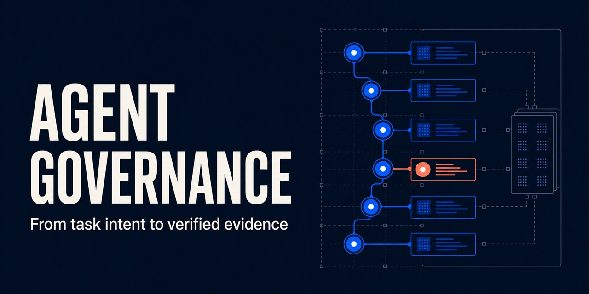
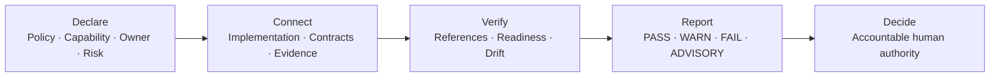
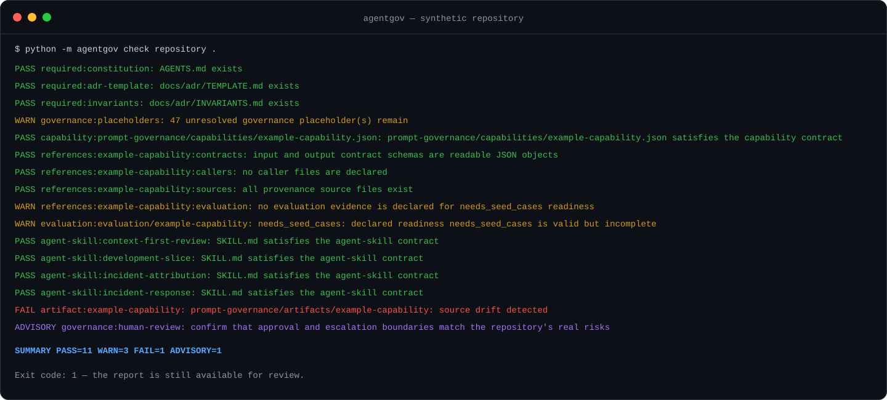

# Agent Governance Starter Kit

**Make AI-assisted repositories reviewable by default.**

A lightweight, repository-native governance framework that connects AI
capabilities, implementation evidence, deterministic checks, and accountable
human decisions. The current development core extends those foundations
into requirement, architecture, and code governance while coding agents are
developing; pull requests and CI remain an independent backstop.

[](https://github.com/Andy-JunXiong/agent-governance-starter/actions/workflows/ci.yml)

[](https://andy-junxiong.github.io/agent-governance-starter/)

<p align="center">
  <strong>Follow one coding-agent task from human-owned intent to reviewable evidence.</strong><br />
  <a href="https://andy-junxiong.github.io/agent-governance-starter/">Explore the AgentGov product story →</a> ·
  <a href="https://andy-junxiong.github.io/agent-governance-starter/portfolio.html">Inspect the evidence portfolio</a> ·
  <a href="https://andy-junxiong.github.io/agent-governance-starter/demo-governance-report.html">Open the sample report</a> ·
  <a href="https://andy-junxiong.github.io/agent-governance-starter/quickstart.html">Read the quickstart</a>
</p>

> The portfolio links claims to repository evidence and states where that evidence stops. It does not authorize commit, merge, publish, release, or deployment.

[Explore the repository product page](docs/index.html) ·
[Open the repository sample report](docs/demo-governance-report.html) ·
[Run the quickstart](#runnable-cli-example) ·
[Inspect the architecture](#detailed-architecture)

## Why this exists

AI-assisted repositories accumulate agent instructions, capability
declarations, implementation references, evaluation evidence, and approval
rules. Those files can all exist while reviewers still cannot answer:

- What requirement and smallest change scope did the human actually admit?
- Which architecture decisions and invariants constrain the coding agent now?
- Has the implementation drifted beyond that task before a PR exists?
- What AI capability is actually present?
- Who owns it, and what decisions may it influence?
- Which implementation and evidence support its claims?
- Did reviewed sources change afterward?
- Which findings are deterministic, and which still require human judgment?

Agent Governance Starter Kit turns those disconnected claims into explicit
repository contracts. It checks what can be checked deterministically and
keeps semantic judgment, merge, publication, release, and deployment under
separate human authority.

## Architecture at a glance



The current stable CLI verifies declared repository facts. ADR-0009 makes the
development loop the current development-source product core; task context, changed-file scope,
fresh completion evidence, guided sessions, redacted event export, and the
static Monitor are implemented in the future-0.3 development source but are
not published in stable 0.2.1. AgentGov does not judge architecture quality,
calculate a governance score, or approve high-risk work.

The accepted minimum sufficient Kernel baseline now separates portable
governance meaning and state semantics from Policy, Application/Product
Surface, Adapter, Consumer Context, and Experiment responsibilities.
Enforcement is a per-transition claim, not a universal layer or control-plane
claim. The minimum journey preserves
`Completion Verified -> Bounded Handoff` as two distinct transitions. New
Kernel promotion is paused until a concrete consumer journey passes the
evidence-backed reopening test in
[ADR-0016](docs/adr/0016-establish-minimum-sufficient-kernel-architecture.md).
The accompanying [dated boundary classification](docs/kernel-boundary-classification-2026-08-10.md)
is diagnostic only and introduces no runtime or schema reorganization.

The decided next lifecycle is:

```text
Human requests work through a coding agent
  -> AgentGov automatically admits or routes the task and relevant context
  -> observes scope and evidence during implementation
  -> reconciles completion and refreshes the protection Dashboard
  -> a human decides at real semantic and authority boundaries
  -> PR/CI independently replays deterministic facts
```

ADR-0013 makes automatic orchestration and an automatically updated Monitor
and Dashboard the accepted primary product experience. Ordinary users should
not hand-author internal JSON, poll `next`, type special confirmation words, or
compose `govern start/check/finish/Monitor/handoff`. Those implemented commands
remain development, headless, CI, diagnostic, testing, fallback, and recovery
primitives. Development source now includes a strict foreground JSONL
coding-agent transport, bounded task/scope/completion cards plus a subordinate
drift-review reminder card, and the first packaged
Codex lifecycle-hook Adapter. Development source now also defines a
vendor-neutral host-interaction request/capability contract and a strict
Coding Agent task-proposal/human-admission fallback. Automatic proposal
generation and native exact-plan review are now connected in development Codex
Adapter `1.3.0`; external live proof, Claude Code/IDE adapters, and native
recording of other custom task/scope/completion decisions remain.
Development source Adapter `1.4.0` now also connects a due drift-review card to
the capability-gated `agentgov_drift_review_record` native form. The Agent can
submit only a three-dimension advisory candidate and repository-relative
evidence; the human alone records that exact candidate, snoozes, or writes
nothing. The due state is revalidated and the local Monitor refreshed. The
exact source is now installed only in the existing local AgentGov pipx runtime.
One bounded direct App Server replay reached the form request and stopped with
no human decision and no record; this proves installed forwarding, not live
Agent tool selection or end-user form presentation. It is not published or
activated in a consumer, and this project's MCP configuration remains unchanged.
Development source Adapter `1.5.0` now removes accountable-owner identity from
the native proposal tool input. The Adapter injects the canonical
`Human product owner` role into the exact reviewed plan, and only bound native
acceptance can persist it as both `owner` and `decided_by`; an Agent-supplied
owner fails before the form and writes nothing. This is human-role mediation,
not cryptographic identification of the individual operator. The generic
proposal and terminal fallback contracts remain unchanged, and `1.5.0` is not
published, released, or active in a consumer. The exact reviewed module is now
installed only in the existing local AgentGov pipx development runtime. Its
unchanged configured command and isolated no-model preflight confirm Adapter
`1.5.0`, protocol `2026-07-28`, seven/form and five/base tool discovery,
pre-elicitation hostile-owner rejection, and human-owned admitted output. The
local repair retained byte-verified `1.4.0` module and launcher backups; it did
not build a wheel, change project configuration, run a model, or start a
consumer replay.
See the [automatic governance product requirements](docs/product-requirements-automatic-governance.md)
and [ADR-0013](docs/adr/0013-make-automatic-governance-and-dashboard-primary.md).
ADR-0014 separately owns semantic-review Provider and assurance routing.



_Actual output from a sanitized synthetic repository: its capability contract
is valid, evaluation evidence remains incomplete, and a later source change
invalidates the generated review artifact._

## What makes it different

| Without explicit contracts | With Agent Governance Starter Kit |
|---|---|
| Prompt, source, test, and review relationships remain implicit. | A manifest connects sources, callers, contracts, evidence, and review metadata. |
| A source change after review is easy to miss. | Artifact hashes report deterministic source drift. |
| Missing evaluation cases can be mistaken for readiness. | `needs_seed_cases` remains an explicit `WARN`. |
| A successful command can be mistaken for approval. | Human approval remains an external boundary. |

## What this project demonstrates

- strict capability manifests with ownership, risk, contracts, provenance, and
  human-review metadata;
- explicit repository inventory closure connecting canonical manifests,
  accountable owners, governance status, and reasoned exclusions;
- strict capability control mappings with explicit applicability, enforcement
  mode, ownership, exception authority, and readable evidence references;
- explicit capability dependency declarations with Inventory closure, cycle
  detection, and optional minimum-readiness floors;
- validation of repository-local schemas, callers, sources, and evaluation
  evidence references;
- explicit evaluation-readiness states that distinguish incomplete evidence
  from supported baseline or regression claims;
- reusable agent operating protocols with triggers, stop conditions, checks,
  escalation, and handoff contracts;
- deterministic, reviewable capability artifacts;
- source, manifest, and generated-artifact drift detection;
- combined foreground and scheduled drift-review reminders for requirement,
  architecture, and functionality alignment in development source;
- repository-level `PASS`, `WARN`, `FAIL`, and `ADVISORY` findings;
- deterministic Markdown and versioned JSON governance reports;
- an installable Python CLI with stable exit-code semantics;
- automated tests and cross-platform CI on Windows and Ubuntu for Python
  3.11, 3.12, and 3.13.

## Scope boundaries

- This is not a general configuration-quality linter, and it does not score
  AGENTS.md or CLAUDE.md writing quality.
- It does not provide runtime policy enforcement or act as a security boundary.
- It connects capability declarations, repository sources, validation
  readiness, generated review artifacts, and human-review requirements.
- Deterministic failures may block automation through a non-zero exit code;
  semantic quality and governance sufficiency remain human-review concerns.
- A matching source hash proves that declared content has not changed since
  artifact generation; it does not prove that the content is correct.
- Missing evidence remains an incomplete readiness state instead of becoming a
  misleading pass or unsupported governance percentage.

## Runnable CLI example

Install the current package into an isolated pipx environment.
This does not copy the starter source tree into the repository you want to
govern:

```powershell
python --version
pipx install "https://github.com/Andy-JunXiong/agent-governance-starter/releases/download/v0.2.1/agent_governance_starter-0.2.1-py3-none-any.whl"
agentgov --version
agentgov --help
```

Running `agentgov` without arguments is also a safe, read-only orientation
surface. It prints the command overview and points first-time users to
`doctor`, `next`, and `status`; it does not inspect or modify the repository.

For an existing installation, use one command to check the tool and repository,
preview the exact bounded change, request one `UPDATE` confirmation, apply it,
and rerun validation:

```powershell
agentgov update .
```

Use `--check` for a strictly read-only CI or diagnostic result:

```powershell
agentgov update --check .
```

Installation necessarily happens before `agentgov next` can run: an
uninstalled CLI cannot inspect or repair its own bootstrap state. The fixed
stable pipx command above is therefore the reviewed pre-install surface.
After installation, `agentgov update --check .` is the explicit read-only
version and repository-layout inspection surface. The future-0.3 development
manifest has no release artifact, so development-source `next` does not invent
or recommend a 0.3 update. [ADR-0011](docs/adr/0011-separate-bootstrap-from-update-routing.md)
records the stable-artifact and terminal-session handoff gates that must exist
before update availability can enter `next`.

See whether governance is merely present or is connected to project workflows:

```powershell
agentgov status .
agentgov status . --format markdown
```

The status surface lists the repository contract, GitHub Actions integration,
declared capabilities, their callers and evaluation readiness, active review
surfaces, and the next accountable action. Markdown output is designed for a
GitHub Actions job summary and uses portable repository-relative commands. It
is read-only and does not run the project or production workflows.

These `status` and `integrate` commands were introduced in stable `0.2.0` and
remain available in published stable `0.2.1`. The `0.2.1` release corrects the
managed workflow's local wheel filename; the checks, reports, and
human-confirmed update boundary are unchanged.

The following current development-source commands expose the low-level
lifecycle for validation and recovery. They are not the accepted final user
journey. Validate an admitted task and select only its repository governance
context with:

```powershell
$env:PYTHONPATH = "src"
python -m agentgov check task governance/tasks/p0-context-selection.json --repository .
python -m agentgov context task governance/tasks/p0-context-selection.json `
  --repository . --format markdown
python -m agentgov check scope governance/tasks/p0-context-selection.json `
  --repository . --format terminal
python -m agentgov govern check governance/tasks/p0-context-selection.json `
  --repository . --format terminal
python -m agentgov govern finish governance/tasks/p0-context-selection.json `
  --repository . --base <comparison-base-revision>
python -m agentgov monitor development .
```

The current low-level guided path removes repeated task and base arguments:

```powershell
$env:PYTHONPATH = "src"
python -m agentgov govern start governance/tasks/my-task.json --repository .
python -m agentgov govern check --repository .
python -m agentgov govern finish --repository .
python -m agentgov monitor development .
python -m agentgov govern handoff --repository . --dry-run
python -m agentgov govern handoff --repository .
python -m agentgov next . --non-interactive
```

The future-0.3 `agentgov next .` source preview can select exactly one of those
steps without executing it. Adoption conflicts, missing scaffold, and
deterministic repository `FAIL` remain higher priority. After those gates, no
active session routes to a dry-run `govern start`; a started task routes to
`govern check`; passed scope or incomplete evidence routes to `govern finish`;
and verified completion routes to `monitor development`. Multiple admitted
tasks require an explicit human choice. Malformed state, task drift, a missing
start event, or failed scope returns one blocking action. WARN and ADVISORY
remain visible in repository checks and reports but do not hide the active
development step.

```powershell
$env:PYTHONPATH = "src"
python -m agentgov next . --non-interactive
```

Text and JSON output contain the selected command and `action_executed=false`;
`next` never creates, repairs, validates, or runs anything.

Development source now places this polling behavior behind the first internal
state projection and a foreground coordinator. The reference adapter builds
bounded triggers from repository state, invokes the same checked primitives,
and refreshes the Dashboard. A strict JSONL process transport can keep one
foreground `agentgov dev` process open while a coding-agent adapter sends
lifecycle events; AgentGov returns one machine-readable response and an
optional bounded task, scope, or completion card per input event. A separate
`agentgov.host-interaction-request` 1.0 describes real human gates, offered
options, delivery mode, decision-recording mode, and denied authority without
adding any host vendor field to Core. The input contract
has no prompt, source, host-path, changed-path, task-identity, or authority
field. AgentGov derives those trusted facts locally.

An adapter can connect its event stream without making the ordinary user
compose lifecycle commands:

```powershell
Get-Content .agentgov-adapter/events.jsonl |
  python -m agentgov dev . --stream --format json
```

The JSONL records use `agentgov.coding-agent-event` 1.0. The first packaged host
integration now maps official Codex `SessionStart`, `UserPromptSubmit`,
`PostToolUse`, and `Stop` hooks into that same vendor-neutral coordinator. Its
`PermissionRequest` binding explicitly leaves Codex's normal human tool
approval prompt undecided; that permission is not task admission, scope,
exception, or completion approval. The Adapter
discards prompt, tool input/output, transcript, assistant-message, model, and
absolute host-path values before building any AgentGov event or hook output.

Preview the development-source project hook integration without writing:

```powershell
python -m agentgov integrate codex-hooks . --dry-run
```

Interactive apply is create-missing-only, requires exact `INTEGRATE`, refuses
to overwrite or merge an existing `.codex/hooks.json`, and does not grant hook
trust. Codex requires the user to review the generated definition separately
through `/hooks`. See the [Codex hooks Adapter guide](docs/codex-hooks-adapter.md).

The existing single-cycle commands remain adapter/headless development and
recovery surfaces:

```powershell
python -m agentgov dev .
python -m agentgov dev . --event implementation.changed
python -m agentgov dev . --event completion.requested
python -m agentgov dev . --event session.reviewed `
  --actor-class human --review-outcome accepted
```

`implementation.changed` automatically observes actual Git paths and records a
scope result. `completion.requested` checks scope, runs only the validation
commands already admitted in the task, reconciles fresh evidence, and refreshes
the Dashboard. Human review may hand off the exact verified session without a
special confirmation word. Missing task admission, scope expansion, external
validation claims, Git authority, and deployment authority still fail closed
or remain human-gated. Stream task, scope, and completion cards offer bounded
action names but do not apply scope, commit, merge, release, or deployment
decisions. A subordinate drift-review card may request an advisory review or
configured snooze without blocking the cycle or applying a semantic verdict.
Each real gate now also carries a proactive, single-select decision
prompt with a safe recommendation and exact option effects. Capable hosts can
return one structured human selection; Codex Hooks remain context-only and
cannot natively record those decisions, so AgentGov reports that capability
drift instead of inventing buttons.

When the direction itself is not yet stable, AgentGov keeps discussion
separate from approval. The vendor-neutral clarification protocol shows the
current center and observed business, requirement, or architecture drift,
asks one natural-language question at a time, and stores only normalized
summaries. Clarification turns do not consume the one-decision friction budget
and have no semantic turn cap. Only after material unknowns are resolved and
option effects are stable does the existing single-select prompt record one
human-owned re-centering choice. That choice updates only the dialogue record;
it does not edit an ADR, admit a task, modify code, or grant downstream
authority. See the [clarification and drift re-centering guide](docs/clarification-dialogue.md).

The same foreground `agentgov dev --stream` connection now carries that flow.
A Coding Agent Adapter can submit strict normalized `agentgov.alignment-context`
instead of raw chat; AgentGov immediately returns one
`agentgov.coding-agent-alignment-response` with either the next clarification
question or the stable final decision. Strict human-originated
`agentgov.clarification-update` and `agentgov.human-decision-result` records
advance the exact in-memory dialogue. Invalid or out-of-order records fail on
their input line before state advances. Dialogue state exists only for that
disclosed foreground process and does not survive restart or mutate the
repository.

Development source now includes a host-side `ReferenceAlignmentAdapter` for
the missing user-facing step. The user supplies an ordinary request and an
ordinary clarification answer; a replaceable host `HostSemanticMaterializer`
returns only small normalized drafts, while the Adapter creates all contract
IDs, digests, timestamps, actor bindings, privacy declarations, and the final
human-result record. Its privacy-safe journey reports clarification and
decision burden, including zero user-authored structured records and internal
commands. The reference tests use an offline fixture materializer: this proves
the integration boundary and full interaction shape, not general semantic
inference or a finished Codex, Claude Code, or IDE UI.

Development source now implements the model-free contract layer from
[ADR-0014](docs/adr/0014-route-semantic-review-through-host-providers.md):
`agentgov.semantic-review-provider-capabilities`,
`agentgov.semantic-review-route`, and `agentgov.semantic-review-result`.
Low risk selects no semantic review; medium risk binds the active Coding Agent
to a clearly labeled self-review; high risk binds a qualifying independent
Reviewer or returns exactly human review, explicit lower-assurance self-review,
and Provider setup as unselected choices. Provider and route digests prevent
silent substitution, and all accepted observations remain `ADVISORY` with no
project or external-write authority. Codex, Claude Code, generic IDE, and
unavailable-Provider fixtures prove vendor-neutral compatibility only:
no real model is bundled by AgentGov, and it includes no credentials, network
call, or independent Reviewer host UI. Ordinary use still requires no second
model configuration.

The execution seam and its live foreground transport are now implemented in
development source.
`ReferenceAlignmentAdapter.self_review(...)` accepts only a resolved
human-alignment result, deterministically selects the medium-risk active-host
route, passes normalized ephemeral context and allowed evidence references to
an `ActiveAgentSelfReviewMaterializer`, and accepts only the exact digest-bound
advisory result. The same `agentgov dev --stream` connection now carries a
strict start/request/draft/completed exchange, bound to the current resolved
dialogue and Coding Agent Adapter. Those records are host-owned; ordinary users
type no JSON, make no additional confirmation, and configure no second model.
Codex and Claude Code fixtures execute through the same path. AgentGov performs
zero model and network calls itself; a native host Adapter is still required
to emit the records and supply real inference. See the
[active-Agent self-review guide](docs/active-agent-self-review.md).

Development source now supplies that first native host boundary as a
dependency-free foreground STDIO MCP Adapter. It exposes five base
model-controlled tools for normalized alignment and medium-risk active-Agent self-review, keeps
an explicit journey handle in foreground memory, and generates every internal
identity and digest itself. Model-authored question IDs have been removed from
the tool inputs; known validation failures now return only a stable code,
stage, bounded field path, rule, and retryable flag, without rejected values or
arbitrary exception text. The start schema keeps judgment-bearing drift
advisory and requires at least two stable options plus one recommendation when
there are no open unknowns. Failed calls remain atomic. Codex project
configuration is available through a
create-missing-only `agentgov integrate codex-mcp . --dry-run` plan; existing
`.codex/config.toml` is never overwritten or merged, and Codex trust remains a
separate user decision. Codex and Claude Code Provider fixtures traverse the
same Core tool path. The first live Codex rehearsal discovered and selected the
tools but failed on the former question-identity/generic-error boundary. A
post-correction replay then bypassed alignment, selected its own change, and
omitted self-review. Intent-oriented tool guidance fixed that selection
boundary, but later fresh replays exposed successive schema/Core mismatches.
Development Adapter `1.2.3` now validates the complete Alignment Start input
boundary before Core, publishes a documented eleven-family parity matrix, and
keeps only generated internal invariant failures unclassified. This remains a testable
contract, not a successful end-to-end host claim. The exact development source
is installed in the local Python 3.12.10 pipx runtime and has passed installed
protocol preflight. One approved external Codex session completed, but its
normalizer mixed actual events with historical repository text, so the run is
not accepted as tool-call evidence. A separately approved replay with an
event-scoped normalizer then completed two real Alignment Start calls: one
retryable correction followed by `ready_for_decision` and the human selection
boundary, with no internal or unclassified failure. This proves Start recovery,
not the live post-selection implementation/self-review journey. Development
Adapter `1.2.4` now hardens the deterministic post-selection boundary: Resolve,
self-review start, and self-review completion classify repairable normalized
input by field and rule before state advances, and corrected same-process retry
remains available. An independent installation-gate audit additionally aligned
reason identifiers, evidence length and allow-list membership, observation
list bounds, and duplicate detection with the downstream Core contracts. This
source is now installed locally as Adapter `1.2.4`; installed protocol and
same-process retry preflight passed with zero AgentGov model or network calls.
The human product owner then designated the current ephemeral Codex session as
the sole approved live continuation and selected the recommended direction.
That session bound the exact human choice through native Alignment Resolve;
focused validation and the complete 734-test Python 3.12 suite pass. The
distinct current-Agent self-review also completed with bounded advisory
observations, zero AgentGov model/network calls, and no Adapter context
retention. This closes the measured current-host post-selection slice without
claiming another host, consumer adoption, release, or deployment. The later
reference task-proposal slice adds an offline-tested host contract seam, not a
production Codex proposal UI or live semantic-quality proof.
Only Codex configuration is packaged. See the
[native governance MCP Adapter guide](docs/governance-mcp-adapter.md).

A Coding Agent or host Adapter can now submit a normalized, vendor-neutral
low-risk proposal without passing the raw prompt to AgentGov Core:

```powershell
python -m agentgov propose task path/to/proposal.json --repository . --dry-run
```

The preview includes the exact final compact task, proposal and task digests,
assumptions, unknowns, sole write target, and denied authority. Applying it
requires exact `ADMIT` from a real interactive terminal and creates only the
reviewed task file. It does not start a session, execute validation, or
authorize code, scope, Git, deployment, or release actions. See the
[task proposal and human admission guide](docs/task-proposal-admission.md).

Development source also includes `ReferenceTaskProposalAdapter`. A Coding
Agent host can supply one replaceable semantic materializer so ordinary request
text produces that same strict, read-only preview without entering AgentGov
Core. The Adapter retains no raw request and owns proposal identity, privacy,
low-risk, and denied-authority fields. Its standalone proof remains fixture-
based.

Development Codex Adapter `1.3.0` now supplies the first production host
binding: the current Codex Agent passes only normalized proposal fields to
`agentgov_task_proposal_review`, then Codex presents the exact generated plan
through native MCP form elicitation. Only the bound human choice to admit that
exact task creates its task file; change, reject, decline, cancellation,
interruption, invalid responses, stale plans, and target races write nothing.
Clients without form elicitation keep the original five tools. AgentGov adds no
credential, model call, network call, or second Agent, and ordinary tool
permission is not admission. The exact source is now installed in the existing
local pipx environment and has passed installed-runtime protocol preflight.
Newly initialized or adopted repositories now receive the same native-tool
selection journey in generated `AGENTS.md`: capable Agents align only when
material direction is unsettled, require a matching admitted task before
repository writes, complete bounded current-Agent self-review, surface due
drift review through the human-owned form, and fail closed when a required
governance call fails. This instruction contract does not itself prove that a
host will select the tools; that still requires a fresh live rehearsal.
Development source Adapter `1.4.0` adds the second capability-gated form tool,
`agentgov_drift_review_record`. It binds one current-Agent advisory candidate
and three dimension observations to a human record/snooze/no-record choice,
rechecks the due baseline before writing, and refreshes the local Monitor.
Clients without form elicitation still receive only the five base tools. This
source is now installed locally but remains unpublished and consumer-inactive.
One temporary-repository direct App Server replay advertised seven tools,
called the drift tool exactly once, reached one bound `form` request with the
three declared options, supplied no human decision, and wrote no record. It is
installed-protocol evidence, not live Agent selection or UI-usability proof.
Development source Adapter `1.5.0` corrects the proposal form's human-owner
binding. The current Agent can no longer supply `owner`; the Adapter-owned
`Human product owner` role appears in the exact preview and may be persisted
only by the bound admit response. This does not authenticate the individual
operator or alter the generic proposal contract. The exact module is now
installed only in the existing local pipx development runtime and passed an
isolated no-model preflight; it remains unpublished, unreleased, and inactive
in consumers, and this does not authorize a consumer replay.
The following proposal replay evidence remains specific to Adapter `1.3.0`.
Standalone authentication is repaired. A separately authorized UTF-8-safe
App Server replay completed one real read-only turn without surfacing a native
form, but its text-presence heuristic could not distinguish a real proposal
tool call from inventory or instructions. That run is `INVALID_MEASUREMENT`,
not Adapter evidence. Test-only structured normalization now accepts only the
exact proposal call, form, result, and terminal event shapes while discarding
raw payloads. A following authorized replay completed a real ephemeral
read-only turn with the valid normalized outcome `not_called`: zero exact
proposal calls and zero forms. This proves that the end-to-end journey did not
enter the Adapter path. The replay evidence alone could not distinguish tool
discovery/configuration from Agent invocation behavior. A later no-turn App
Server configuration/status probe separately confirmed that the project MCP
layer loaded and all six AgentGov tools were exposed, so the remaining observed
gap is Agent invocation under an ambiguous trigger contract, not tool
discovery. A later consumer replay loaded the generated journey but still
treated direct chat authorization as admission and skipped both proposal
review and self-review. Development guidance now requires a readable,
validated matching `governance/tasks/*.json` record with a human admitted or
approved decision before any repository write. Direct chat authorization and
tool permission do not count; every repository-changing task requires the
distinct self-review pass, while read-only work remains exempt. This guidance
cannot deterministically force model tool
selection and is not Adapter pass/fail evidence. The separately authorized
installation-only step has now built the exact reviewed source offline as a
local-only `0.3.0rc1` wheel with SHA-256
`F109E8A951605AE947374EE28BB76B569A344BC3DD20A752E1686AF8C317FDFE`
and replaced only the existing AgentGov pipx runtime. Installed discovery
confirms Adapter `1.3.0`, protocol `2026-07-28`, six tools with form capability,
five without it, and the clarified trigger metadata; project configuration is
byte-for-byte unchanged. At that installation checkpoint no Codex turn or
replay had started. In one later, separately authorized ephemeral read-only
turn, the exact proposal tool started once; the turn then completed without a
native form. The run created no task or implementation and changed no repository
state. This is positive invocation evidence but not a successful native
proposal-review journey. Two later no-model direct App Server probes passed the
same valid arguments to the installed tool; App Server parsed the Adapter's
elicitation and automatically returned `decline` because no active turn could
host it, with zero repository write. The retained replay summary does not record
whether a completion event carried an AgentGov structured error, so
`call_started` cannot distinguish pre-form input rejection from live-turn
forwarding or presentation behavior. The first confirmed follow-up gap is this
measurement ambiguity, not a proven Adapter, App Server, or UI defect. That
ambiguity is now corrected for future evidence: the test-only reducer records
deduplicated completion count/status, distinguishes `completion_unknown`, and
retains only bounded `agentgov.mcp-tool-error` code, matching stage, field path,
rule, and retryability. Raw errors, arguments, content, and extensions remain
dropped. The already discarded historical events cannot be reconstructed or
reclassified. That one-turn authorization is consumed and another replay is not
admitted.

A third independent AIRBNB replay then loaded the stricter journey and
proactively called `agentgov_task_proposal_review` before any repository write.
The call failed closed before form presentation because that initialized
consumer had no real `governance/tasks/` directory; no task or requested README
change was created. Initializer output now includes the tracked
`governance/tasks/.gitkeep` bootstrap so a new consumer can build its first
read-only proposal plan without a preparatory manual write. Existing consumers
must add that directory through a reviewed adoption update before retrying.

AIRBNB subsequently adopted that repair. A 2026-08-11 proposal replay reached
exact human admission and a bounded README implementation but could not run its
runtime. A separately admitted 2026-08-13 cumulative journey supersedes that
specific limitation: an isolated Python 3.11.9 environment ran the documented
research-only scenario, 5 delivery tests, 13 serving tests, and all 79 tests
without failure or skip. AgentGov reconciled the admitted working-copy scope
and fresh evidence as Completion Verified, after which the human separately
confirmed Bounded Handoff; repeating the handoff preview was idempotent. The
proposal-only tasks used a disclosed bounded current-Agent advisory review and
did not fabricate native alignment self-review completion. This is bounded
evidence for one consumer journey, not proof of the automatic primary
experience, product effectiveness, independent review, consumer commit or
push, CI enforcement, release, deployment, or production pricing authority.
The consumer changes remain uncommitted and unpushed.

On 2026-08-14 one separately admitted uncoached AIRBNB baseline then selected
the expected proposal-review tool without governance or protocol coaching. Its
first two normalized proposals failed atomically on non-repository-relative
scope paths, a third call completed declined without a human form reaching the
client, and no consumer task or source change occurred. Development source now
turns that bounded result into Harness Contract v1: a strict
`agentgov.harness-run` 1.0 schema, dependency-free offline validator and First
Deviation evaluator, and sanitized matching/AIRBNB fixtures. The evaluator
keeps Agent selection, AgentGov decision correctness, and intervention outcome
as separate channels and identifies proposal materialization before the later
form-mediation gap. It rejects raw replay material, false post-action `BLOCK`
claims, invalid ordering, duplicate transition identity, and authority drift.
This fixture-backed contract does not rerun a model, prove causality or product
effectiveness, publish a percentage, or provide a live host Adapter or public
CLI. See the [Harness Contract v1 guide](docs/harness-contract-v1.md).

NYC then supplied a second independent bounded consumer journey. Under Python
3.11.9, its existing reviewed synthetic sample completed schema validation,
temporary Bronze and Silver construction, the demand quality gate, and
non-empty Gold lineage; the focused scenario passed 1 test and the complete NYC
suite passed all 68 tests. Repository governance reported 17 PASS, 1 WARN, and
0 FAIL, while all 4 agent-skill contracts passed. AgentGov recorded fresh
evidence and `completion.reconciled: verified`, followed by a separate
human-confirmed `session.handed_off: handed_off`; its repeat preview returned
`already_handed_off`. NYC's formal CI remains on AgentGov 0.2.1: this local
0.3.0rc1 consumer journey is not a formal upgrade. The result is another
bounded portability example, not proof of uncoached automatic adoption,
production forecast quality, product effectiveness, independent review,
control effectiveness, publication, release, deployment, or external
authority. The NYC consumer changes remain uncommitted and unpushed.

That exact `ADMIT` path is now a review fallback rather than a universal daily
gate. Development source adds `agentgov.work-request` 1.0,
`agentgov.admission-routing-policy` 1.0, and `agentgov.admission-route` 1.0:
questions, explanations, status queries, and read-only diagnosis need no task;
verified in-scope active work is not readmitted; a clean human-owned standing
policy can fast-track a bounded low-risk task with zero human interruptions;
and material or ambiguous work still stops for review.

```powershell
python -m agentgov route request path/to/request.json `
  --policy governance/admission-policy.json --repository .
```

Only `fast_track` may use `--apply-fast-track`, which creates the task but does
not start a session or execute code. A planned low-risk `human_review` can use
`--prompt-human`: AgentGov proactively displays approve/change/reject choices
and accepts one number, with no `ADMIT` word or free-text rationale. Approval
revalidates and creates only the exact reviewed task; the other selections
write nothing. See the [risk-based admission routing guide](docs/admission-routing.md)
and [minimal-input decision guide](docs/human-decision-prompts.md).
Current stable 0.2.1 and published `v0.3.0rc1` behavior is unchanged until a
later release.

Development source now implements ADR-0012's event-only `govern handoff`.
Preview re-establishes the exact verified evidence and lists one append-only
event target; apply requires exact interactive `HANDOFF` and retains the
session pointer, task, evidence, Monitor, and prior events. A matching handoff
is idempotent. Afterwards, read-only `next` excludes the same task digest and
previews a separate `govern start --replace-active --dry-run`: it names one
other task, preserves `<TASK_JSON>` choice among several, or supplies compact
task placeholders when none remain. Handoff means only “stop routing this
working-copy session”; it does not mean requirement correctness, architecture
approval, Monitor review, implementation acceptance, or merge readiness. This
surface is not part of published stable 0.2.1.

When development observations need to move into CI, preview and explicitly
create a metadata-only export, then build the corresponding Monitor:

```powershell
python -m agentgov export development --repository . --dry-run
python -m agentgov export development --repository .
python -m agentgov monitor development . `
  --scope exported_development `
  --export .agentgov/exports/exp-<id>.json
```

The write requires exact interactive `EXPORT` confirmation. It removes actor
labels and local evidence references, rejects sensitive or unsafe records, and
never uploads the resulting file or changes GitHub Actions.

The future 0.3 managed governance workflow template adds a separate, default-off
manual dispatch input named `publish_development_monitor`. After a reviewed 0.3
release and workflow migration, an owner may enable it in the Actions UI and may
optionally provide the repository-relative `development_export` path. With no
export, the Monitor is honestly `ci_only`; with a validated metadata-only export
it is `exported_development`, or `combined` only when actor-validated CI event
files are also present. The artifact contains only
`agentgov-development-monitor.html`, never the export bundle, raw events, or the
`.agentgov/` directory. This source implementation does not publish 0.3 or
change an existing consumer workflow.

For a low-risk task, `govern start --title ... --include ...` previews a compact
task contract and can detect conventional Python, npm, Cargo, or Go validation.
Every start is previewed; a real terminal must confirm exactly `START` (or
`REPLACE` for a different active task). Non-interactive and `--dry-run`
execution write nothing. See [guided development governance
sessions](docs/development-session.md).

Context selection derives an in-memory Registry from the repository's own
`AGENTS.md`, task references, Skill metadata, and capability relationships. It
does not create `registry.json`, modify Git, or authorize implementation. This
interface is a future-0.3 development preview, not part of stable 0.2.1.
The scope command separately inventories staged, unstaged, deleted, renamed,
and non-ignored untracked paths and applies segment-aware include/exclude
rules. It is read-only and currently covers working-tree changes, not already
committed task changes.

Preview a deterministic logical index for dated development logs without
writing, moving, renaming, or deleting any record:

```powershell
agentgov plan documentation-archive . --through 2026-08-14
agentgov plan documentation-archive . --through 2026-08-14 --format json
agentgov plan documentation-archive . --through 2026-08-15 --apply
```

The explicit through-date avoids host-clock dependence. The human-facing
candidate uses compact date, title, and link entries, while source hashes stay
in JSON and terminal diagnostics as machine-verifiable evidence. The output
retains stable same-day ordering and exact create/update/no-op classification,
while usefulness remains an advisory human decision. Planning is read-only by
default. `--apply` prints the exact plan, requires a real interactive terminal
and `APPLY INDEX`, then regenerates the full source-hash-bound plan before it
exclusively creates or atomically updates only `docs/development-log/INDEX.md`.
It never opens dated logs for write and grants no scheduling, Git, publication,
release, or deployment authority. See
[documentation archive-index planning](docs/documentation-archive-plan.md).

The higher-level development preview records `govern check` observations in
untracked `.agentgov/` local state. `govern finish --base` runs the admitted
task's declared validation commands, binds them to committed, staged,
unstaged, renamed, and non-ignored untracked identities, and returns
`verified` only when the validation-to-finish snapshot is unchanged and in
scope. It stores hashes and repository-relative identifiers rather than source,
command text, or validation output. Passing evidence does not prove semantic
requirement or architecture correctness and grants no Git authority.
The Monitor command turns the validated local events into a self-contained
Overview, Live Sessions, Protection Events, Activity Timeline, and Task Detail dashboard at
`.agentgov/dashboard.html`. It always displays partial observation scope and
missing sources, separates observed facts from inference and unknowns, and
contains no approval or governance mutation controls. It supports honest
`local_session`, `exported_development`, `ci_only`, and `combined` source
boundaries; every timeline event identifies its input source, and even a
combined view keeps cross-stage discovery unavailable.

The working-copy session pointer is strict, untracked local state rather than a
second governance source of truth. It lets check and finish resume one admitted
task and exact comparison base; task drift fails closed. The start event records
which governance paths the Router selected, while the Monitor keeps actual
coding-agent consumption explicitly unknown.

The accepted next Dashboard makes this read model automatically updated, adds
explicit protection resolution links, and adds Benefit and Learning views. Benefit claims
must distinguish observed facts, reproduced comparisons with denominators,
supported inference, human feedback, and unknowns. The product will not publish
a single governance, protection, ROI, or benefit score without a documented
applicability and comparison model.

Preview a pinned consumer CI workflow, then explicitly create it after review:

```powershell
agentgov integrate github-actions . --dry-run
agentgov integrate github-actions .
```

The generated workflow verifies and installs a fixed AgentGov Release, records update state,
writes the JSON repository report on every push or pull request, and uploads the
reports as CI artifacts. Starting with 0.2, it also generates the consumer-local
stable upgrade review, appends it to the job summary, and uploads its evidence.
It also checks for stable updates on a weekday schedule when the repository has
no push or pull-request activity.
It uses read-only repository permissions, does not install adopting-project
dependencies, and never authorizes merge, release, deployment, or production
execution. Existing workflow content is never overwritten.

Prepare—but do not execute—the exact change for a future upgrade PR:

```powershell
agentgov plan upgrade-pr . --manifest release-manifest.json
```

Create the consumer-facing upgrade review inside the adopting project:

```powershell
agentgov review upgrade . --manifest release-manifest.json `
  --output agentgov-upgrade-review
```

Compare two preserved CI reports as honest benefit evidence:

```powershell
agentgov benefits compare before.json after.json
```

Collect one candidate wheel, manifest, source-test, and independent-consumer compatibility review
without making the release decision:

```powershell
agentgov review release . --wheel <WHEEL> --manifest <MANIFEST> `
  --consumer <CONSUMER_REPOSITORY> --output <NEW_REVIEW_DIRECTORY>
```

Upgrade planning and benefit comparison are read-only. Release and consumer
upgrade review write only their explicitly named new evidence directories and
refuse existing output. Consumer upgrade review does not apply the planned
workflow change. None of these commands creates a branch, pull request, tag,
release, deployment, causal claim, coverage percentage, or ROI claim.

The updater discovers the latest stable GitHub Release manifest, downloads the
fixed-tag wheel into a temporary directory, verifies its SHA-256, upgrades the
pipx environment, verifies the installed version, and relaunches the new
`agentgov` process before repository refresh. Mutable branch files are never
used as installation metadata. Redirected input, JSON mode, and non-interactive
mode never authorize writes. `agentgov refresh` remains available as an
advanced repository-only preview/apply command.

Interactive update output uses explicit terminal states:

- `SUCCESS`: update and final validation completed;
- `CANCELLED`: confirmation was not granted and nothing changed;
- `BLOCKED`: compatibility, integrity, or release metadata prevents a write;
- `INTERRUPTED`: execution stopped before a write;
- `PARTIAL`: a declared file was created, but interruption or validation failure
  requires the printed `RECOVERY` command;
- `ERROR`: an operational input, I/O, or contract error prevented completion.

Progress is printed as `CHECK`, `PLAN`, `APPLY`, and `VALIDATE`. Every
non-success result states whether repository files changed and prints one
recovery action where automation can determine it.

Create a synthetic governed repository, inspect it, and write a review report.

PowerShell:

```powershell
$Project = Join-Path $PWD "governed-demo"
python -m agentgov init $Project --project-name "Portfolio Demo"
python -m agentgov check repository $Project
python -m agentgov report repository $Project --output "$Project/governance-report.md"
```

Bash or zsh:

```bash
project="$PWD/governed-demo"
python -m agentgov init "$project" --project-name "Portfolio Demo"
python -m agentgov check repository "$project"
python -m agentgov report repository "$project" --output "$project/governance-report.md"
```

The demo initializes a clean repository, runs the repository contract, and
writes `governance-report.md`. It intentionally retains honest `WARN` and
`ADVISORY` findings: a successful run proves the checks executed, not that
governance is complete.

For capability, reference, evaluation, agent-skill, artifact, and repository
checks in one sequence, continue to the
[complete clean-repository walkthrough](#clean-repository-adoption-path).

### How to read the result

- `PASS` — a deterministic contract is satisfied.
- `WARN` — a valid, non-blocking configuration or evidence state is incomplete.
- `FAIL` — a deterministic requirement is broken or a reviewed artifact is stale.
- `ADVISORY` — accountable human judgment is still required.

These findings describe repository state. They do not authorize merge,
publication, release, or deployment.

## Example findings

These examples use identifiers and semantics emitted by the current
implementation:

```text
PASS capability:governance/capabilities/example-capability.json: governance/capabilities/example-capability.json satisfies the capability contract
WARN evaluation:evaluation/example-capability: needs_seed_cases: declared readiness needs_seed_cases is valid but incomplete
FAIL artifact:example-capability: governance/artifacts/example-capability: source drift detected
ADVISORY governance:human-review: confirm that approval and escalation boundaries match the repository's real risks
```

## Detailed architecture


`agentgov` treats repository files as the source of truth. Its read-only
repository check validates declared contracts, checks artifact integrity and
drift, and aggregates the results into one ordered findings model. Terminal,
Markdown, JSON, and status are different views of the same repository state.
The bounded consumer CI integration runs the JSON report without installing
the adopting project's dependencies. Artifact export is a separate explicit
write command, not a stage inside repository checking.

The checker can establish structural, reference, readiness, and integrity
facts. It cannot approve high-risk transitions: merge, publication, release,
and deployment remain separate human-authorized actions.

## Project status and non-goals

**Status: published stable `0.2.1`; published Pre-release `v0.3.0rc1`.** The
stable release is suitable for evaluation and repository-level pilots. The
development source adds a two-workflow proposal boundary, compact/standard
development tasks, read-only task-specific governance context, and a
default-off Development Monitor artifact path in the future 0.3 workflow
template. The candidate is published for review but is not promoted to stable
or adopted by a consumer workflow. Its published manifest conservatively lists
only `0.1.0` in `supported_from`; the source workflow now passes the reviewed
metadata so a later candidate can publish the complete declared compatibility
set without rewriting `v0.3.0rc1`. AgentGov is not
a compliance certification, runtime
security boundary, or authorization for autonomous merge, publication, or
deployment.

The current release is not a SaaS control plane, general configuration-quality
linter, generic LLM evaluation platform, real-time agent monitor, deployment
system, or runtime enforcement service.

## Design principles

- **Repo-native:** policy and evidence live beside the code they govern.
- **Human-controlled:** agents may prepare and verify changes, while people
  retain approval over high-risk transitions.
- **Explicit readiness:** incomplete evaluation is reported as incomplete, not
  presented as a passing benchmark.
- **Portable:** templates describe reusable contracts rather than one
  project's infrastructure or business rules.
- **Reviewable:** governance decisions, capability metadata, checks, and reports
  are inspectable artifacts.
- **Minimum sufficient Kernel:** seek invariants, compose existing meanings,
  preserve authority and evidence distinctions, and promote new concepts only
  from traceable, proportionate counterevidence.

## Current scope

The first usable release contains:

1. project constitution, ADR, invariant, and agent-protocol templates;
2. an AI-capability metadata schema for deterministic, model, prompt, and
   hybrid implementations;
3. evaluation-readiness guidance;
4. a small set of deterministic repository checks;
5. deterministic Markdown and JSON v1.0 governance reports;
6. read-only usage status and a create-missing-only consumer CI integration in
   the development line;
7. read-only upgrade-PR planning and two-snapshot benefit evidence in the
   development line;
8. an experimental development-source task contract and `check task` command
   that preserve human-owned requirement, architecture, scope, approval, and
   stop boundaries before implementation;
9. a read-only development-preview planner for a deterministic logical index
   of dated development logs, with no apply or scheduling path;
10. AI Radar as a documented origin reference, plus isolated consumer pilots;
   neither is a runtime dependency.

## Project navigation

- [Web quickstart](docs/quickstart.html) provides a copyable PowerShell and
  Bash/zsh adoption path.
- [中文 Web 快速开始](docs/quickstart.zh-CN.html) provides the equivalent
  browser-friendly Chinese path.
- [中文快速开始](docs/quickstart.zh-CN.md) provides a concise installation,
  inspection, adoption, and validation workflow for Chinese-speaking users.
- [Existing repository adoption](docs/existing-repository-adoption.md) provides
  the complete inspect, dry-run, create-missing-only, and validation workflow.
- [Generated files guide](docs/generated-files-guide.md) explains the human
  decisions required in each scaffold area.
- [Troubleshooting](docs/troubleshooting.md) covers installation, conflicts,
  findings, reports, artifacts, and exit codes.
- [Consumer CI and status](docs/consumer-ci.md) explains automatic pull-request
  checks, update visibility, report artifacts, and remaining human authority.
- [Codex hooks Adapter](docs/codex-hooks-adapter.md) explains the optional
  project hook mapping, privacy boundary, create-only integration, and separate
  Codex trust review.
- [Upgrade PR automation](docs/upgrade-pr-automation.md) defines the safe
  proposal contract, bounded Draft PR writer, and one-time 0.3 bootstrap.
- [Consumer upgrade review](docs/consumer-upgrade-review.md) explains the
  adopting-project UI, exact workflow patch, gates, and approval boundary.
- [Documentation archive-index planning](docs/documentation-archive-plan.md)
  explains dated-log eligibility, exact candidate output, deterministic versus
  advisory findings, and the non-destructive authority boundary.
- [Benefit evidence](docs/benefit-monitor.md) explains report comparison,
  trusted main baselines, the continuous monitor UI, denominators, and claims
  that cannot be made.
- [Remaining development plan](docs/development-plan.md) separates implemented,
  published, and consumer-adopted behavior and orders the next delivery slices.
- [Minimum sufficient Kernel decision](docs/adr/0016-establish-minimum-sufficient-kernel-architecture.md)
  defines the Constitution, responsibility boundaries, minimum journey, and
  evidence required to reopen Kernel promotion.
- [Kernel boundary classification](docs/kernel-boundary-classification-2026-08-10.md)
  records the dated diagnostic mapping without creating a permanent registry or
  migration plan.
- [AgentGov product and architecture plan (Chinese Revision 4)](docs/proposals/2026-08-02-agentgov-product-and-architecture-plan.zh-CN.md)
  consolidates the GitHub distribution, AI Radar-aligned development
  governance, trigger routing, observation events, and Monitor/Dashboard
  proposal for human and Claude review.
- [Development trigger and routing semantics](docs/specs/development-trigger-routing-v1.md)
  fixes segment-aware path matching, include/exclude precedence, rename
  handling, trigger classification, and the Phase 2 policy-test gate.
- [Fresh validation evidence semantics](docs/specs/fresh-validation-evidence-v1.md)
  fixes canonical Git snapshot scope, tool-state exclusions, validation
  artifact behavior, workflow ordering, and the Phase 3 hard gate.
- [Open product decisions](docs/open-decisions-2026-08-02.md) records the
  resolved development-time boundary and the remaining interface, delivery,
  upgrade, and benefit questions.
- [0.2.0rc1 release notes](docs/releases/0.2.0rc1.md) describe compatibility,
  changes, evidence, and the published candidate boundary.
- [0.2.0 release notes](docs/releases/0.2.0.md) describe the prepared stable
  promotion and its remaining human-controlled gates.
- [0.2.1 release notes](docs/releases/0.2.1.md) describe the consumer CI
  wheel-filename correction found by the first independent consumer pilot.
- [Release channels](docs/release-channels.md) explain the separate stable and
  release-candidate workflows, GitHub UI, and human-controlled tag boundary.
- [Release review bundle](docs/release-review.md) explains automated evidence
  collection and the remaining human approve/change/reject decision.
- [Case study](docs/case-study.md) explains the product decisions, trust
  boundary, implementation, validation, and current limitations.
- [Architecture-drift case AG-DRIFT-001](docs/case-studies/0001-pr-center-architecture-drift.md)
  records how locally valid adoption, CI, and upgrade-PR slices displaced the
  original development-time governance priority, and makes that history the
  first P0 task-contract acceptance scenario.
- [Development task contract](docs/development-task-contract.md) documents the
  experimental schema, read-only CLI check, finding boundary, and deferred
  changed-file and completion work.
- [Development task schema](schemas/development-task.schema.json) defines the
  versioned machine-readable `agentgov.development-task` contract.
- [Coding-agent task proposal and human admission](docs/task-proposal-admission.md)
  documents the strict normalized proposal, read-only admission plan, exact
  interactive `ADMIT`, exclusive task creation, and privacy/authority limits.
- [Task proposal schema](schemas/task-proposal.schema.json) and
  [task admission plan schema](schemas/task-admission-plan.schema.json) define
  the vendor-neutral input and exact read-only output contracts.
- [Risk-based admission routing](docs/admission-routing.md) documents no-task
  work, active-task reuse, clean standing delegation, material-risk review,
  friction budgets, and non-interactive fast-track limits.
- [Proactive minimal-input human decisions](docs/human-decision-prompts.md)
  documents digest-bound prompts/results, safe recommendations, one-selection
  host behavior, reference numeric selection, and Codex capability limits.
- [Governed clarification and drift re-centering](docs/clarification-dialogue.md)
  documents vendor-neutral multi-turn discussion, center/drift separation,
  normalized rolling records, readiness rules, and final human re-centering.
- [Admission routing policy](schemas/admission-routing-policy.schema.json),
  [work request](schemas/work-request.schema.json), and
  [admission route](schemas/admission-route.schema.json) schemas define the
  strict routing contracts.
- [Human decision prompt](schemas/human-decision-prompt.schema.json) and
  [human decision result](schemas/human-decision-result.schema.json) schemas
  define the strict display-versus-selection boundary.
- [Alignment context](schemas/alignment-context.schema.json),
  [clarification dialogue](schemas/clarification-dialogue.schema.json),
  [clarification prompt](schemas/clarification-prompt.schema.json), and
  [clarification update](schemas/clarification-update.schema.json) schemas
  define the strict discussion-before-decision boundary.
- [Coding Agent alignment response](schemas/coding-agent-alignment-response.schema.json)
  defines the strict foreground Adapter output, one-prompt exclusivity,
  memory-only persistence claim, and denied project authority.
- [Development governance context](docs/development-context.md) documents the
  derived in-memory Registry, selection modes, CLI formats, compact/standard
  profiles, and current authority limits.
- [Development context schema](schemas/development-context.schema.json) defines
  the strict derived `agentgov.development-context` output contract.
- [Guided development governance session](docs/development-session.md) documents
  start preview/confirmation, compact task scaffolding, the single-active-task
  working-copy boundary, and check/finish defaults.
- [Development session schema](schemas/development-session.schema.json) defines
  the strict local pointer without duplicating governance declarations.
- [Development changed-file scope check](docs/development-scope-check.md)
  documents read-only Git inventory, segment-aware decisions, rename handling,
  advisory architecture routing, and current committed-change limits.
- [Development scope report schema](schemas/development-scope-report.schema.json)
  defines the strict derived changed-file result contract.
- [Fresh validation evidence and completion reconciliation](docs/development-evidence.md)
  documents canonical Git snapshots, `verified` limits, recovery guidance,
  local events, and the validation-command trust boundary.
- [Development evidence schema](schemas/development-evidence.schema.json),
  [completion schema](schemas/development-completion.schema.json), and
  [governance event schema](schemas/governance-event.schema.json) define the
  privacy-bounded future-0.3 derived records.
- [Development governance Monitor](docs/development-monitor.md) documents the
  local static Dashboard, four observation scopes, safe generated-file
  refresh, and observed/inferred/unknown layers.
- [Drift review reminders](docs/drift-review-reminders.md) document the shared
  three-task/seven-day cadence, non-blocking foreground card, future scheduled
  CI summary, immutable human records, and advisory authority boundary.
- [Development automation contracts](docs/development-automation-contracts.md)
  documents the first internal lifecycle-state and vendor-neutral adapter
  trigger contracts, their denied authority, and the remaining foreground
  coordinator boundary.
- [Active-Agent self-review and live transport](docs/active-agent-self-review.md)
  documents the resolved-alignment precondition, host-neutral callback,
  two-stage foreground exchange, evidence allow-list, digest binding, privacy
  boundary, and native-installation limit.
- [Native governance MCP Adapter](docs/governance-mcp-adapter.md) documents the
  five base alignment/self-review tools plus the capability-gated native task
  proposal review, explicit handle and binding rules, Codex create-missing-only
  configuration, cross-host boundary, and live-rehearsal limit.
- [Redacted development-event export](docs/development-event-export.md)
  documents the explicit preview/confirmation flow, metadata-only profile,
  immutable bundle, Monitor ingestion, and privacy/claim boundaries.
- [Development event export schema](schemas/development-event-export.schema.json)
  defines the strict portable bundle and denied authority fields.
- [Development Monitor schema](schemas/development-monitor.schema.json) defines
  its strict Overview, Live Sessions, Protection Events, Timeline, Task Detail,
  observation, and authority data.
- [Installed development-governance pilot](docs/experiments/installed-development-governance-pilot.md)
  records the exact wheel, independent repository, actual Coding Agent context
  consumption, fail-closed setup findings, verified completion, and claim
  limits for the first end-to-end development loop.
- [Governance model](docs/governance-model.md) defines the conceptual chain and
  finding semantics.
- [ADR-0009](docs/adr/0009-govern-coding-agents-during-development.md) records
  development-time requirement, architecture, and code governance as the
  product core and PR/CI as the retained backstop.
- [ADR-0014](docs/adr/0014-route-semantic-review-through-host-providers.md)
  records model-free Provider capability, risk routing, assurance disclosure,
  advisory result binding, and no-silent-downgrade behavior.
- [Capability Dependencies](docs/capability-dependencies.md) defines explicit
  Inventory-linked dependency edges, cycle checks, and optional readiness
  floors.
- [v0.1 adoption rehearsal](docs/v0.1-adoption-rehearsal.md) records the
  isolated installed-package workflow and observed output.
- [AI Radar extraction map](docs/ai-radar-extraction-map.md) documents what was
  adapted, rewritten, retained as reference only, or explicitly excluded.
- [CLI source](src/agentgov/cli.py) exposes the implemented commands and exit
  behavior.
- [Automated tests](tests) cover contracts, failure behavior, artifacts,
  adoption, reports, and CI assumptions.
- [Release metadata](release/README.md) defines the machine-readable
  compatibility input consumed by the read-only update check.
- [AI capability schema](governance/capability.schema.json) and the generated
  canonical capability template
  show the machine-readable contract.
- [Evaluation manifest schema](evaluation/schemas/evaluation-manifest.schema.json)
  defines the supported readiness states and evidence metadata.
- [Repository report schema](schemas/repository-report.schema.json) defines the
  stable JSON v1.0 integration boundary.

## Repository layout

```text
agent-governance-starter/
|-- agent-skills/       # Reusable coding-agent operating protocols
|-- checks/             # Deterministic governance checks
|-- docs/               # Methodology and reference material
|-- evaluation/         # Evaluation-readiness contracts
|-- governance/         # AI capabilities, contracts, evidence, and artifacts
|-- prompt-governance/  # Legacy compatibility fixtures
|-- schemas/            # Versioned machine-readable report contracts
|-- src/agentgov/       # Python CLI and governance checks
|-- templates/          # Repository governance templates
`-- tests/              # Automated validation
```

## Development setup

Python 3.11 or newer is required.

```powershell
$env:PYTHONPATH = "src"
python -m unittest discover -s tests -v
```

## Development task contract preview

The current development source can validate one human-declared task before or
during coding-agent work:

```powershell
$env:PYTHONPATH = "src"
python -m agentgov check task governance/tasks/p0-minimal-task-contract.json `
  --repository .
```

The command checks structure, safe repository-local references, admission and
approval consistency, and the declared task boundary without modifying files
or Git state. Requirement meaning, architecture sufficiency, and objective
alignment remain explicit `ADVISORY` judgments. This is a development preview,
not a capability of published stable 0.2.1; see the
[development task contract guide](docs/development-task-contract.md).

## Clean-repository adoption path

After installing the package, initialize a new or empty project directory and
run the complete starter workflow. In PowerShell, paste the block into the
terminal and press Enter. Change `governed-example` if that directory already
exists. The CLI prints the next review step after initialization.

```powershell
$Project = Join-Path $PWD "governed-example"
agentgov init $Project --project-name "Example Project"
agentgov check capability "$Project/governance/capabilities/example-capability.json"
agentgov check references "$Project/governance/capabilities/example-capability.json" --repository $Project
agentgov check evaluation "$Project/evaluation/example-capability"
agentgov check agent-skills "$Project/agent-skills"
agentgov export capability "$Project/governance/capabilities/example-capability.json" --repository $Project
agentgov check artifact "$Project/governance/artifacts/example-capability" --repository $Project
agentgov check repository $Project
agentgov report repository $Project --output "$Project/governance-report.md"
```

Read `governance-report.md` after the commands finish. Successful command
completion means that the static checks ran; it does not mean governance is
complete. `WARN` findings still require a human to complete or explicitly
defer the gap, and `ADVISORY` findings require recorded human judgment. No
check result authorizes an agent to merge, publish, release, or deploy; each of
those actions requires separate explicit human approval.

The initialized example intentionally remains at `needs_seed_cases`. Unresolved
governance placeholders and missing evaluation evidence are reported as
non-blocking warnings until a human adapts the scaffold. The workflow proves
that the package and contracts connect correctly; it does not claim that a
project's governance or model behavior is complete. The recorded installed
package rehearsal is documented in
[the v0.1 adoption rehearsal](docs/v0.1-adoption-rehearsal.md).

To measure the human bootstrap experience, follow the
[fresh uncoached guided-onboarding pilot](docs/human-adoption-pilot.md) and preserve the
result with the
[human adoption record template](docs/human-adoption-record.template.md).
Give a fresh participant only the
[uncoached onboarding handout](docs/uncoached-onboarding-handout.md), the
repository URL, and a non-sensitive test repository; do not give them the
facilitator protocol during the session.
Automated duration must not be reported as human adoption evidence.

## Existing-repository inspection

Inspect an existing repository before deciding how to adopt the starter kit:

```powershell
agentgov inspect path/to/existing-repository
agentgov inspect path/to/existing-repository --format json
```

The command is read-only. It reports which core governance paths already exist,
which are missing, and whether common repository instruction files such as
`CLAUDE.md` or `.github/copilot-instructions.md` were discovered. It does not
read, reconcile, copy, or judge those instruction files. The resulting adoption
plan keeps each missing path as a deliberate human-reviewed change; successful
inspection does not mean governance is complete. Missing paths are non-blocking
adoption information. A path with the wrong type or a symbolic link is a
deterministic `CONFLICT` and returns exit code `1`; operational errors return
`2`. JSON contract version `1.0` is defined by
[`schemas/adoption-report.schema.json`](schemas/adoption-report.schema.json).

After reviewing the inspection result, preview a safe existing-repository
adoption:

```powershell
agentgov adopt path/to/existing-repository --project-name "Example Project" --dry-run
```

The plan lists files that would be created and existing files that would be
preserved. Rerunning without `--dry-run` creates only missing scaffold files
after a complete conflict preflight. Existing regular files are never
overwritten, and symbolic links or path-type conflicts stop adoption. The
command does not reconcile existing instruction text and does not run Git
commands. Continue with the
[existing repository adoption guide](docs/existing-repository-adoption.md),
then use the [generated files guide](docs/generated-files-guide.md) to adapt the
scaffold. Common failures are covered by
[troubleshooting](docs/troubleshooting.md).

## Capability check

From a source checkout:

```powershell
$env:PYTHONPATH = "src"
python -m agentgov check capability prompt-governance/fixtures/valid/runtime-low-risk.json
```

This command intentionally exercises a legacy compatibility fixture. New
repositories use canonical manifests under `governance/capabilities/`;
`prompt-governance/` remains a bounded, read-only compatibility surface.

After installing the package, the equivalent command is:

```powershell
agentgov check capability path/to/capability.json
```

Exit codes are stable for automation:

- `0`: the manifest passes the capability contract;
- `1`: the manifest is readable JSON but violates the contract;
- `2`: usage, file access, encoding, or JSON structure prevents the check.

Contract failures are printed to standard output as check findings. Operational
errors are printed to standard error. This slice validates manifest content;
repository-local reference integrity is checked separately.

Check contract schemas, declared callers, provenance sources, and evaluation
evidence with:

```powershell
$env:PYTHONPATH = "src"
python -m agentgov check references path/to/capability.json --repository .
```

Required or explicitly declared paths that are missing, unsafe, symbolic, or
malformed fail deterministically. Missing evaluation evidence for an honest
early readiness state is a non-blocking warning. Logical model-route names are
not treated as filesystem paths.

## Templates

The [template set](templates/README.md) includes a repository constitution, ADR
record, invariant register, and contract-valid AI-capability starting
manifest. Markdown placeholders are explicit and must be reviewed before use.

Preview initialization without writing:

```powershell
$env:PYTHONPATH = "src"
python -m agentgov init path/to/new-project --project-name "Example Project" --dry-run
```

Remove `--dry-run` to generate the scaffold. v0.1 accepts only a new or empty
target directory, never overwrites existing files, and reports all unresolved
governance placeholders for human review. It also installs evaluation schemas,
the readiness policy, an honest `needs_seed_cases` starter bundle, and the
generic agent operating protocols.

## Agent operating protocols

Validate all direct child protocols under an `agent-skills` directory:

```powershell
$env:PYTHONPATH = "src"
python -m agentgov check agent-skills agent-skills
```

The check enforces portable frontmatter, explicit use and non-use conditions,
and a common workflow, safety, escalation, and handoff structure. The seven
starter protocols cover human-owned `requirement-admission`,
`context-first-review`, `development-slice`, advisory
`action-loop-stagnation`, scoped `reconcile-invariants`,
`incident-attribution`, and `incident-response`. The first five govern the
coding agent during development; pull requests and CI remain an independent
backstop. The protocols contain no project-specific runtime or cloud
dependency, and an advisory stop request is not a mechanical runtime halt.

## Repository check

The generated `governance/inventory.json` declares the repository's governed
canonical capabilities and explicit exclusions. Inventory closure is
deterministic, while completeness remains an `ADVISORY`: the checker cannot
prove that every real AI capability was discovered or declared. See the
[Governance Inventory guide](docs/governance-inventory.md) for the contract and
finding semantics.

When that Inventory passes, configured evaluation bundles and review artifacts
must name a listed capability through their own `capability_name` contract
field. Unknown names are deterministic orphan failures; directory names are
not used to infer identity. Missing optional evidence remains non-blocking.

Generated projects also include a starter
[Capability Control Mapping](docs/control-mapping.md). Configured mappings must
name an Inventory capability, use globally unique control IDs, and connect
applicable controls to readable implementation and verification references.
Deterministic validation is paired with an effectiveness `ADVISORY`; it does
not certify semantic sufficiency or calculate control coverage.

Generated projects also include an empty
[Capability Dependencies](docs/capability-dependencies.md) declaration.
Configured edges must connect Inventory capabilities; self-dependencies,
cycles, orphan endpoints, and unmet explicitly declared readiness floors are
deterministic failures. A readiness difference remains non-blocking when an
edge does not declare `minimum_readiness`, and completeness remains advisory.

Check an initialized repository with:

```powershell
$env:PYTHONPATH = "src"
python -m agentgov check repository path/to/project
```

The command checks required governance files, unresolved placeholders, AI
capability manifests, inventory, control mappings, explicit capability
dependencies, evidence closure, repository-local references, discovered
evaluation bundles, agent protocols, and configured capability artifacts.
Missing artifacts remain a non-blocking
`WARN`; malformed or stale configured artifacts are `FAIL`. It emits `PASS`,
`WARN`, `FAIL`, and `ADVISORY`
findings plus a deterministic summary. WARN and ADVISORY findings are
non-blocking; any FAIL returns exit code `1`. It does not calculate a governance
coverage percentage or infer architecture quality from matching text.

## Capability artifacts and source drift

Export a validated capability manifest as deterministic, repository-local
review artifacts:

```powershell
$env:PYTHONPATH = "src"
python -m agentgov export capability governance/capabilities/example.json `
  --repository .
```

The default output is
`governance/artifacts/<capability-name>/CAPABILITY.md` plus
`artifact.json`. Export hashes canonical manifest content and the declared
repository-relative source files. It never copies source content and refuses
to overwrite generated files unless `--replace` is explicit.

Check for manifest, source, or generated-file drift with:

```powershell
python -m agentgov check artifact `
  governance/artifacts/<capability-name> --repository .
```

Both manifest, sources, and output must stay inside the declared repository
root. A matching hash detects change, not capability quality or correctness.

## Repository report formats

Markdown remains the default for backward compatibility. The explicit
`--format markdown` form produces the same output:

```powershell
$env:PYTHONPATH = "src"
python -m agentgov report repository path/to/project
python -m agentgov report repository path/to/project --format markdown
python -m agentgov report repository path/to/project --output governance-report.md
```

Use JSON when another local tool needs a stable machine-readable contract:

```powershell
agentgov report repository . --format json
agentgov report repository . --format json --output governance-report.json
```

Use the self-contained HTML report when a first-time user or reviewer needs a
visual explanation of the findings and human-review boundary:

```powershell
agentgov report repository . --format html --output governance-report.html
```

The HTML file opens locally without a server. It contains inline styling and a
small status filter, embeds the same machine-readable report document, makes no
external network requests, and does not provide approval or repository-write
controls.

Both formats are serialized from the same repository findings and contain
summary counts, findings, known gaps, recommended actions, and scope
limitations. JSON contract version `1.0` is defined by the
[repository report schema](schemas/repository-report.schema.json). It is the
integration boundary used by the bounded consumer CI workflow and remains
available to potential future web UI or API consumers.

Reports contain no coverage percentage or timestamp. File output refuses to
overwrite an existing path; repositories with FAIL findings still produce a
report and return exit code `1`.

## Evaluation readiness

Validate an evaluation bundle and its declared readiness with:

```powershell
$env:PYTHONPATH = "src"
python -m agentgov check evaluation evaluation/fixtures/baseline-ready
```

The check distinguishes honest early-stage readiness (`WARN`) from supported
baseline/regression readiness (`PASS`) and unsupported maturity claims
(`FAIL`). It validates evidence structure and review metadata, not model quality
or benchmark performance.

Readiness is not an acceptance or release decision. The optional evaluation
`decision` records a reviewed outcome separately, so a candidate can have
complete regression evidence and still be honestly `rejected`. Regression
thresholds support either a case pass rate or a relative comparison with a
named baseline. See the
[`regression-ready-rejected` fixture](evaluation/fixtures/regression-ready-rejected)
for a complete example.

## Reference implementation

The initial patterns were extracted from lessons learned while building AI
Radar. AI Radar remains a separate product and repository. This project does
not import AI Radar packages or reproduce its product-specific evidence and
workflow logic. See [the extraction map](docs/ai-radar-extraction-map.md).
The current revalidation confirms that portable consistency means governing the
coding agent during requirement admission, architecture grounding,
implementation, verification, and closeout. It does not mean copying AI Radar's
business gates or runtime.

## License

Released under the [MIT License](LICENSE).
