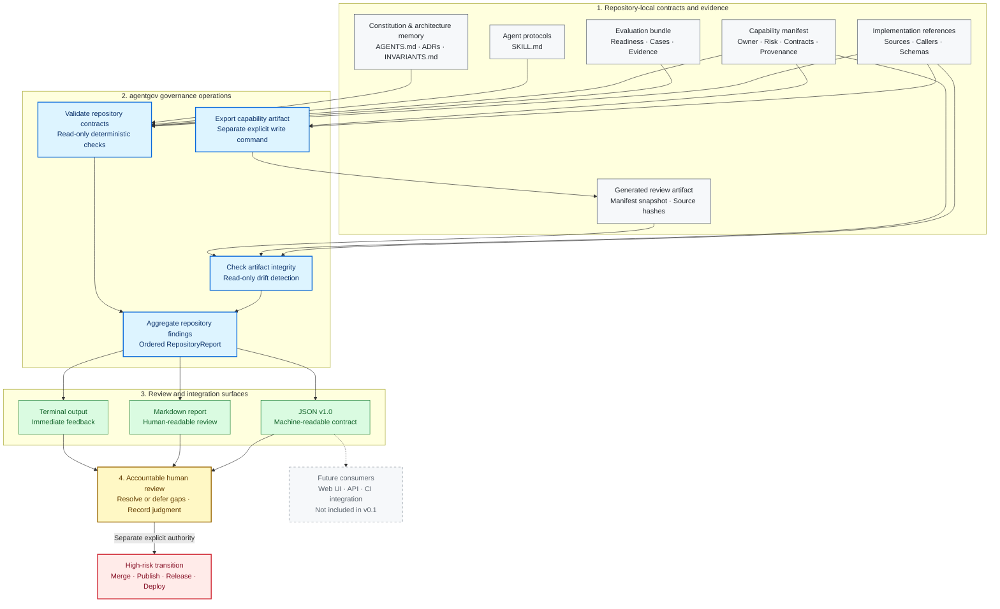

# Agent Governance Starter Kit

A reference implementation for repository-native capability, evidence, and human-review contracts in AI-assisted software development.

[](https://github.com/Andy-JunXiong/agent-governance-starter/actions/workflows/ci.yml)


_Actual output from a sanitized synthetic repository: its capability contract
is valid, evaluation evidence remains incomplete, and a later source change
invalidates the generated review artifact._

## The problem

AI-assisted repositories may contain prompts, agent instructions, capability
definitions, evaluation evidence, and approval rules, but those artifacts are
often disconnected. A reviewer still needs to answer:

- What capability is being introduced?
- Which repository sources define that capability?
- What validation evidence currently supports it?
- Has the source changed since the evidence or review artifact was produced?
- Is a finding deterministic, or does it require human judgment?
- Which high-risk transitions remain under human control?

Agent Governance Starter Kit connects those questions through repository-local
contracts and deterministic checks without pretending that static analysis can
replace accountable human review.

## Why this matters

| Without explicit contracts | With Agent Governance Starter Kit |
|---|---|
| Prompt, source, test, and review relationships remain implicit. | A manifest connects sources, callers, contracts, evidence, and review metadata. |
| A source change after review is easy to miss. | Artifact hashes report deterministic source drift. |
| Missing evaluation cases can be mistaken for readiness. | `needs_seed_cases` remains an explicit `WARN`. |
| A successful command can be mistaken for approval. | Human approval remains an external boundary. |

## What this project demonstrates

- strict capability manifests with ownership, risk, contracts, provenance, and
  human-review metadata;
- validation of repository-local schemas, callers, sources, and evaluation
  evidence references;
- explicit evaluation-readiness states that distinguish incomplete evidence
  from supported baseline or regression claims;
- reusable agent operating protocols with triggers, stop conditions, checks,
  escalation, and handoff contracts;
- deterministic, reviewable capability artifacts;
- source, manifest, and generated-artifact drift detection;
- repository-level `PASS`, `WARN`, `FAIL`, and `ADVISORY` findings;
- deterministic Markdown and versioned JSON governance reports;
- an installable Python CLI with stable exit-code semantics;
- automated tests and cross-platform CI on Windows and Ubuntu for Python
  3.11, 3.12, and 3.13.

## What makes the design different

- This is not a general configuration-quality linter, and it does not score
  AGENTS.md or CLAUDE.md writing quality.
- It does not provide runtime policy enforcement or act as a security boundary.
- It connects capability declarations, repository sources, validation
  readiness, generated review artifacts, and human-review requirements.
- Deterministic failures may block automation through a non-zero exit code;
  semantic quality and governance sufficiency remain human-review concerns.
- A matching source hash proves that declared content has not changed since
  artifact generation; it does not prove that the content is correct.
- Missing evidence remains an incomplete readiness state instead of becoming a
  misleading pass or unsupported governance percentage.

## Thirty-second demo

After cloning the repository, install the package locally:

```powershell
python -m pip install --no-deps .
```

Then paste this PowerShell block into a directory where `governed-demo` does
not already exist:

```powershell
$Project = Join-Path $PWD "governed-demo"
agentgov init $Project --project-name "Portfolio Demo"
agentgov check repository $Project
agentgov report repository $Project --output "$Project/governance-report.md"
```

The demo initializes a clean repository, runs the repository contract, and
writes a report. A successful run does not resolve the reported placeholders
or grant authority to merge, publish, release, or deploy.

### How to read the result

- `PASS` — a deterministic contract is satisfied.
- `WARN` — a valid, non-blocking configuration or evidence state is incomplete.
- `FAIL` — a deterministic requirement is broken or a reviewed artifact is stale.
- `ADVISORY` — accountable human judgment is still required.

These findings describe repository state. They do not authorize merge,
publication, release, or deployment.

## Example findings

These examples use identifiers and semantics emitted by the current
implementation:

```text
PASS capability:prompt-governance/capabilities/example-capability.json: prompt-governance/capabilities/example-capability.json satisfies the capability contract
WARN evaluation:evaluation/example-capability: needs_seed_cases: declared readiness needs_seed_cases is valid but incomplete
FAIL artifact:example-capability: prompt-governance/artifacts/example-capability: source drift detected
ADVISORY governance:human-review: confirm that approval and escalation boundaries match the repository's real risks
```

## Architecture



`agentgov` treats repository files as the source of truth. Its read-only
repository check validates declared contracts, checks artifact integrity and
drift, and aggregates the results into one ordered findings model. Terminal,
Markdown, and JSON are different views of the same repository state. Artifact
export is a separate explicit write command, not a stage inside repository
checking.

The checker can establish structural, reference, readiness, and integrity
facts. It cannot approve high-risk transitions: merge, publication, release,
and deployment remain separate human-authorized actions.

## Project status and non-goals

**Status: Experimental (`0.1.0.dev0`).** The project is suitable for evaluation
and repository-level pilots. It is not a compliance certification, a runtime
security boundary, or authorization for autonomous merge, publication, or
deployment.

The current release is not a SaaS control plane, general configuration-quality
linter, generic LLM evaluation platform, real-time agent monitor, deployment
system, or runtime enforcement service.

## Design principles

- **Repo-native:** policy and evidence live beside the code they govern.
- **Human-controlled:** agents may prepare and verify changes, while people
  retain approval over high-risk transitions.
- **Explicit readiness:** incomplete evaluation is reported as incomplete, not
  presented as a passing benchmark.
- **Portable:** templates describe reusable contracts rather than one
  project's infrastructure or business rules.
- **Reviewable:** governance decisions, prompt metadata, checks, and reports
  are inspectable artifacts.

## v0.1 scope

The first usable release contains:

1. project constitution, ADR, invariant, and agent-protocol templates;
2. a prompt-capability metadata schema;
3. evaluation-readiness guidance;
4. a small set of deterministic repository checks;
5. deterministic Markdown and JSON v1.0 governance reports;
6. AI Radar as a documented reference case, not a runtime dependency.

## Project navigation

- [Case study](docs/case-study.md) explains the product decisions, trust
  boundary, implementation, validation, and current limitations.
- [Governance model](docs/governance-model.md) defines the conceptual chain and
  finding semantics.
- [v0.1 adoption rehearsal](docs/v0.1-adoption-rehearsal.md) records the
  isolated installed-package workflow and observed output.
- [AI Radar extraction map](docs/ai-radar-extraction-map.md) documents what was
  adapted, rewritten, retained as reference only, or explicitly excluded.
- [CLI source](src/agentgov/cli.py) exposes the implemented commands and exit
  behavior.
- [Automated tests](tests) cover contracts, failure behavior, artifacts,
  adoption, reports, and CI assumptions.
- [Capability schema](prompt-governance/capability.schema.json) and a
  [valid capability fixture](prompt-governance/fixtures/valid/runtime-low-risk.json)
  show the machine-readable contract.
- [Evaluation manifest schema](evaluation/schemas/evaluation-manifest.schema.json)
  defines the supported readiness states and evidence metadata.
- [Repository report schema](schemas/repository-report.schema.json) defines the
  stable JSON v1.0 integration boundary.

## Repository layout

```text
agent-governance-starter/
|-- agent-skills/       # Reusable coding-agent operating protocols
|-- checks/             # Deterministic governance checks
|-- docs/               # Methodology and reference material
|-- evaluation/         # Evaluation-readiness contracts
|-- prompt-governance/  # Prompt-capability schemas and examples
|-- schemas/            # Versioned machine-readable report contracts
|-- src/agentgov/       # Python CLI and governance checks
|-- templates/          # Repository governance templates
`-- tests/              # Automated validation
```

## Development setup

Python 3.11 or newer is recommended.

```powershell
$env:PYTHONPATH = "src"
python -m unittest discover -s tests -v
```

## Clean-repository adoption path

After installing the package, initialize a new or empty project directory and
run the complete starter workflow. In PowerShell, paste the block into the
terminal and press Enter. Change `governed-example` if that directory already
exists. The CLI prints the next review step after initialization.

```powershell
$Project = Join-Path $PWD "governed-example"
agentgov init $Project --project-name "Example Project"
agentgov check capability "$Project/prompt-governance/capabilities/example-capability.json"
agentgov check references "$Project/prompt-governance/capabilities/example-capability.json" --repository $Project
agentgov check evaluation "$Project/evaluation/example-capability"
agentgov check agent-skills "$Project/agent-skills"
agentgov export capability "$Project/prompt-governance/capabilities/example-capability.json" --repository $Project
agentgov check artifact "$Project/prompt-governance/artifacts/example-capability" --repository $Project
agentgov check repository $Project
agentgov report repository $Project --output "$Project/governance-report.md"
```

Read `governance-report.md` after the commands finish. Successful command
completion means that the static checks ran; it does not mean governance is
complete. `WARN` findings still require a human to complete or explicitly
defer the gap, and `ADVISORY` findings require recorded human judgment. No
check result authorizes an agent to merge, publish, release, or deploy; each of
those actions requires separate explicit human approval.

The initialized example intentionally remains at `needs_seed_cases`. Unresolved
governance placeholders and missing evaluation evidence are reported as
non-blocking warnings until a human adapts the scaffold. The workflow proves
that the package and contracts connect correctly; it does not claim that a
project's governance or model behavior is complete. The recorded installed
package rehearsal is documented in
[the v0.1 adoption rehearsal](docs/v0.1-adoption-rehearsal.md).

To measure the human bootstrap experience, follow the
[ten-minute human adoption pilot](docs/human-adoption-pilot.md) and preserve the
result with the
[human adoption record template](docs/human-adoption-record.template.md).
Automated duration must not be reported as human adoption evidence.

## Capability check

From a source checkout:

```powershell
$env:PYTHONPATH = "src"
python -m agentgov check capability prompt-governance/fixtures/valid/runtime-low-risk.json
```

After installing the package, the equivalent command is:

```powershell
agentgov check capability path/to/capability.json
```

Exit codes are stable for automation:

- `0`: the manifest passes the capability contract;
- `1`: the manifest is readable JSON but violates the contract;
- `2`: usage, file access, encoding, or JSON structure prevents the check.

Contract failures are printed to standard output as check findings. Operational
errors are printed to standard error. This slice validates manifest content;
repository-local reference integrity is checked separately.

Check contract schemas, declared callers, provenance sources, and evaluation
evidence with:

```powershell
$env:PYTHONPATH = "src"
python -m agentgov check references path/to/capability.json --repository .
```

Required or explicitly declared paths that are missing, unsafe, symbolic, or
malformed fail deterministically. Missing evaluation evidence for an honest
early readiness state is a non-blocking warning. Logical model-route names are
not treated as filesystem paths.

## Templates

The [template set](templates/README.md) includes a repository constitution, ADR
record, invariant register, and contract-valid prompt-capability starting
manifest. Markdown placeholders are explicit and must be reviewed before use.

Preview initialization without writing:

```powershell
$env:PYTHONPATH = "src"
python -m agentgov init path/to/new-project --project-name "Example Project" --dry-run
```

Remove `--dry-run` to generate the scaffold. v0.1 accepts only a new or empty
target directory, never overwrites existing files, and reports all unresolved
governance placeholders for human review. It also installs evaluation schemas,
the readiness policy, an honest `needs_seed_cases` starter bundle, and the
generic agent operating protocols.

## Agent operating protocols

Validate all direct child protocols under an `agent-skills` directory:

```powershell
$env:PYTHONPATH = "src"
python -m agentgov check agent-skills agent-skills
```

The check enforces portable frontmatter, explicit use and non-use conditions,
and a common workflow, safety, escalation, and handoff structure. The starter
protocols cover context-first proposal review, bounded development slices,
collaboration-failure attribution, and evidence-first operational incident
response; they contain no project-specific runtime or cloud dependency.

## Repository check

Check an initialized repository with:

```powershell
$env:PYTHONPATH = "src"
python -m agentgov check repository path/to/project
```

The command checks required governance files, unresolved placeholders, prompt
capability manifests, their repository-local references, discovered evaluation
bundles, agent protocols, and configured capability artifacts. Missing artifacts remain a non-blocking
`WARN`; malformed or stale configured artifacts are `FAIL`. It emits `PASS`,
`WARN`, `FAIL`, and `ADVISORY`
findings plus a deterministic summary. WARN and ADVISORY findings are
non-blocking; any FAIL returns exit code `1`. It does not calculate a governance
coverage percentage or infer architecture quality from matching text.

## Capability artifacts and source drift

Export a validated capability manifest as deterministic, repository-local
review artifacts:

```powershell
$env:PYTHONPATH = "src"
python -m agentgov export capability prompt-governance/capabilities/example.json `
  --repository .
```

The default output is
`prompt-governance/artifacts/<capability-name>/CAPABILITY.md` plus
`artifact.json`. Export hashes canonical manifest content and the declared
repository-relative source files. It never copies source content and refuses
to overwrite generated files unless `--replace` is explicit.

Check for manifest, source, or generated-file drift with:

```powershell
python -m agentgov check artifact `
  prompt-governance/artifacts/<capability-name> --repository .
```

Both manifest, sources, and output must stay inside the declared repository
root. A matching hash detects change, not capability quality or correctness.

## Repository report formats

Markdown remains the default for backward compatibility. The explicit
`--format markdown` form produces the same output:

```powershell
$env:PYTHONPATH = "src"
python -m agentgov report repository path/to/project
python -m agentgov report repository path/to/project --format markdown
python -m agentgov report repository path/to/project --output governance-report.md
```

Use JSON when another local tool needs a stable machine-readable contract:

```powershell
agentgov report repository . --format json
agentgov report repository . --format json --output governance-report.json
```

Both formats are serialized from the same repository findings and contain
summary counts, findings, known gaps, recommended actions, and scope
limitations. JSON contract version `1.0` is defined by the
[repository report schema](schemas/repository-report.schema.json). It is the
integration boundary for a potential future web UI, API, or CI consumer; none
of those integrations are part of the current product.

Reports contain no coverage percentage or timestamp. File output refuses to
overwrite an existing path; repositories with FAIL findings still produce a
report and return exit code `1`.

## Evaluation readiness

Validate an evaluation bundle and its declared readiness with:

```powershell
$env:PYTHONPATH = "src"
python -m agentgov check evaluation evaluation/fixtures/baseline-ready
```

The check distinguishes honest early-stage readiness (`WARN`) from supported
baseline/regression readiness (`PASS`) and unsupported maturity claims
(`FAIL`). It validates evidence structure and review metadata, not model quality
or benchmark performance.

## Reference implementation

The initial patterns were extracted from lessons learned while building AI
Radar. AI Radar remains a separate product and repository. This project does
not import AI Radar packages or reproduce its product-specific evidence and
workflow logic. See [the extraction map](docs/ai-radar-extraction-map.md).

## License

Released under the [MIT License](LICENSE).
